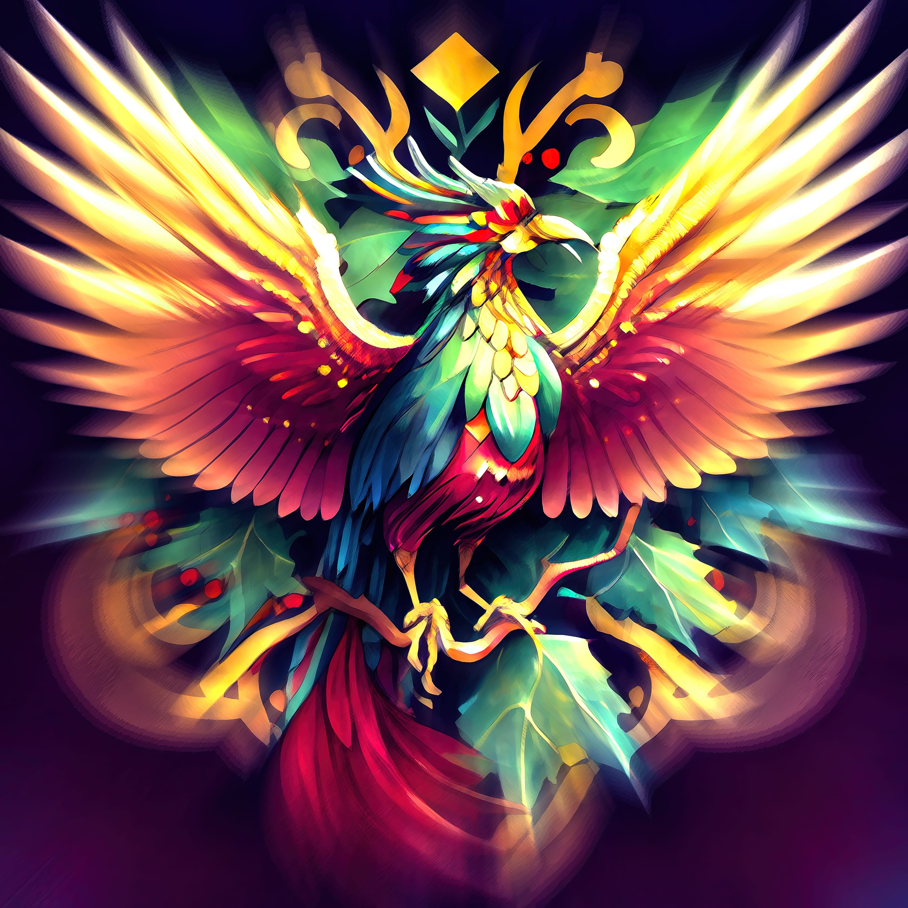

# A Phixel Christmas Story: The Phoenix 🐦
Once upon a time, on a cold and snowy Christmas Eve, the team at Phixel was hard at work creating beautiful and engaging designs for their clients. As they worked, they heard a faint knocking at the door. They opened it to find a small, bedraggled-looking Phoenix shivering on their doorstep. The team was surprised, but they invited the Phoenix inside and gave it a warm place to rest by the fire.

As the Phoenix recovered, it told the team its story. It was the last of its kind, the last Phoenix on Earth. It had been searching for a new home, a place where it could be reborn from its own ashes and continue its eternal cycle of life and death. The team at Phixel was touched by the Phoenix’s story and decided to help it.

They used their design skills and knowledge of the golden ratio to create a new home for the Phoenix. They crafted a beautiful, symmetrical nest made of the finest materials and placed it in the center of their workspace. The Phoenix was overjoyed and thanked the team for their kindness.

On Christmas morning, the team gathered around the Phoenix’s nest and watched in amazement as the Phoenix burst into flames and was reborn from its own ashes. As they celebrated the Phoenix’s rebirth, they realized that they had found a new meaning of Christmas: the joy of giving and the power of renewal.

From that day on, the Phoenix became a symbol of hope and renewal for the team at Phixel. They continued to create beautiful designs for their clients and used the golden ratio to create balance and symmetry in all their work. And every Christmas, they would gather around the Phoenix’s nest and celebrate the true meaning of the season.
------------
## Exerpt
Discover the new meaning of Christmas with a tale of giving and renewal!
## Description
The team at Phixel was working hard at the office when they heard a knock on the door. The last thing they expected was to see a Phoenix standing there, but that’s exactly what happened.
## Media

------------
- **Slug:** christmas-story-phoenix
- **Date:** 19/12/2022
- **URL:** [https://phixel.net/en/story/christmas-story-phoenix/](https://phixel.net/en/story/christmas-story-phoenix/)
- **Type:** [Blog](#blog)
- **Hashtags:** #christmasstory, #phoenix, #phixel, #christmas, #goldenratio, #design, #giving, #renewal, #hope, #christmaspirit, #christmasmagic
- **Emojis:** 🎄🔥💙🐦🎁🎅🦅💭💡🌟🙏

------------
## Tags
[ ](# )
