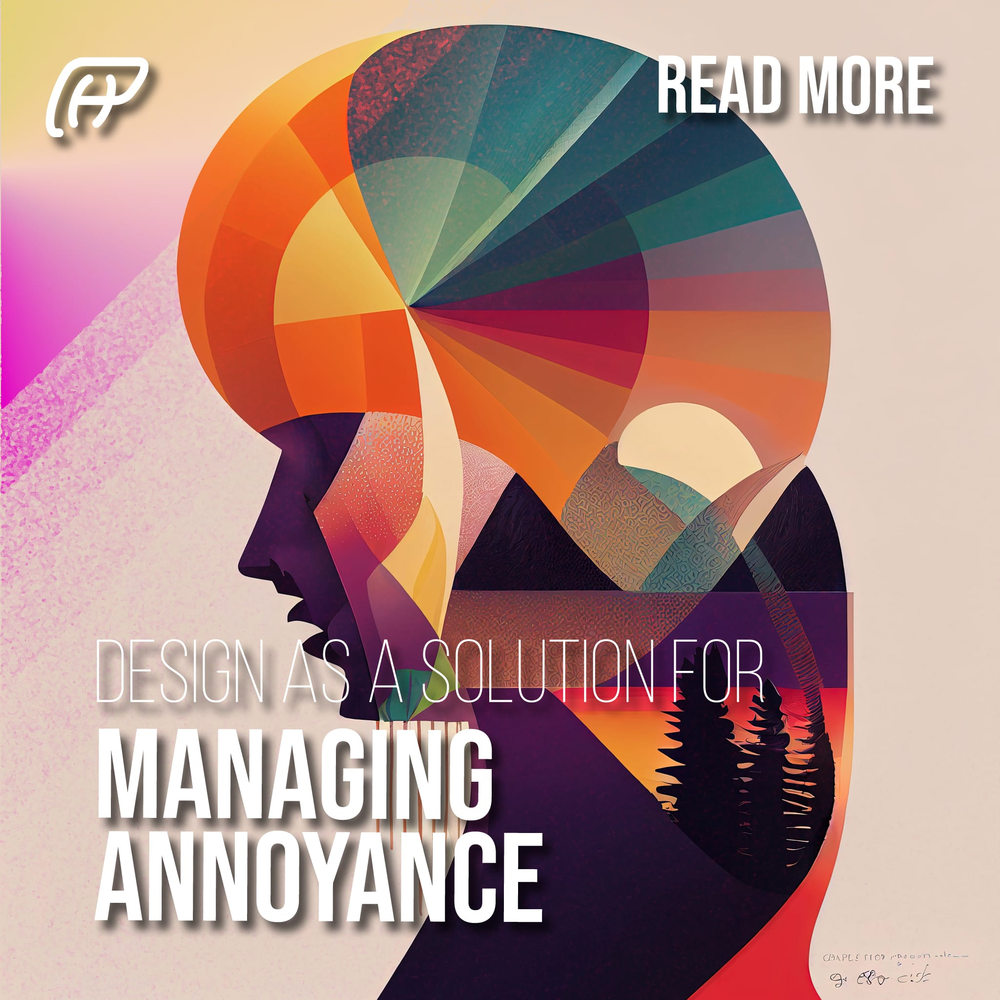
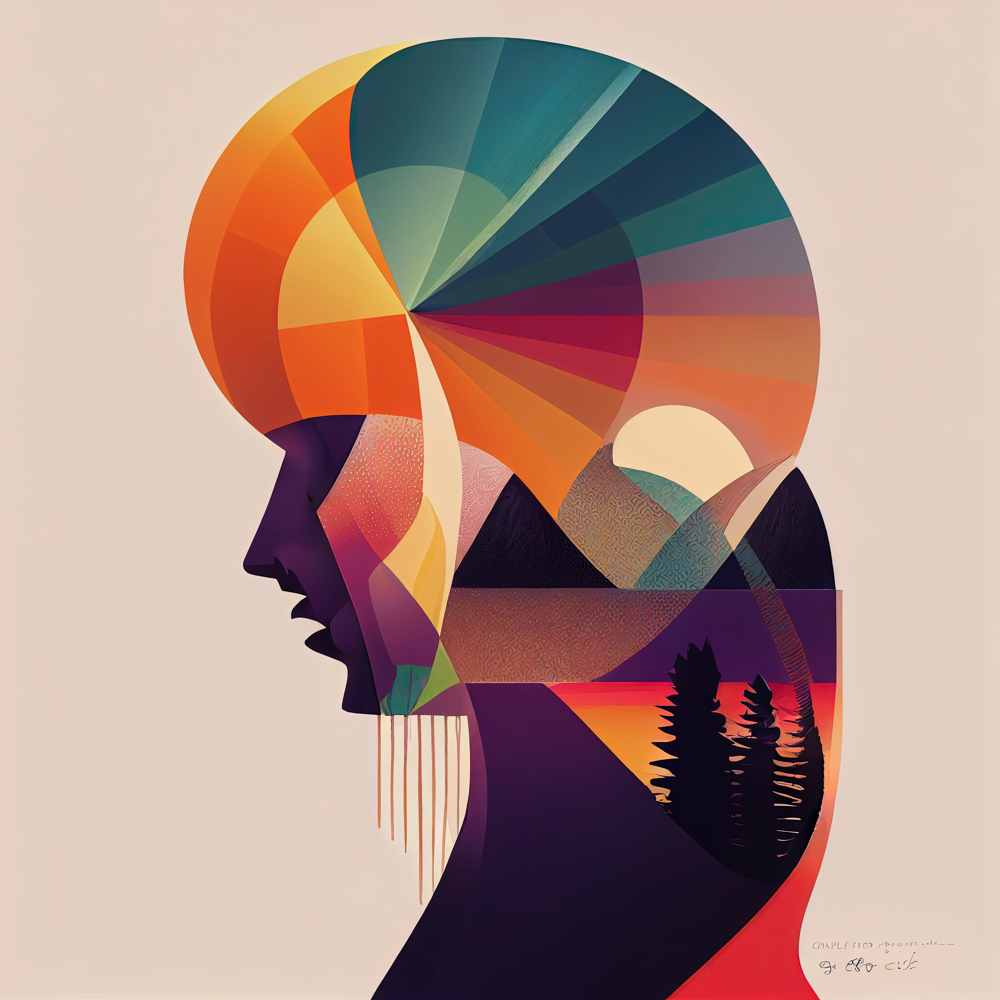

# Design as a Solution for Managing Annoyance 😩
### Annoyance can be a difficult emotion to deal with, as it often arises from small irritations or larger frustrations. It can lead to feelings of anger, frustration, and a lack of motivation. However, Design can provide a solution for managing annoyance in a constructive way. In this article, we’ll explore 10 tips for using Design as a tool for managing annoyance.

- **Identify the source of annoyance:** The first step in managing annoyance is to identify its source. Understanding the source of your annoyance will help you to better target your design solutions.
- **Use color to represent emotions:** Color can be a powerful tool for representing emotions and helping to process them. Bright and bold colors can represent feelings of annoyance, while cooler colors like blue and green can represent a sense of calm and balance.
- **Play with shape and form:** Shape and form can also be used to represent emotions and help to process them. Sharp and jagged shapes can represent feelings of annoyance, while rounded and organic shapes can represent a sense of calm and resolution.
- **Use imagery that represents overcoming obstacles:** Rather than avoiding imagery that represents annoyance, consider using imagery that represents overcoming obstacles. Images of a person breaking through a barrier or climbing a mountain can represent the idea of perseverance and triumph.
- **Use storytelling:** Storytelling can be a powerful tool for understanding and processing annoyance. By using design elements like typography, imagery, and color to tell your story, you can create a sense of understanding and closure.
- **Use positive affirmations:** Positive affirmations can help to change negative thought patterns and boost self-esteem. Incorporating positive affirmations into your design can help to counteract feelings of annoyance and promote a sense of determination.
- **Incorporate symmetry:** Symmetry can create a sense of balance and stability that can help to process feelings of annoyance. By incorporating symmetry into your design, you can create a sense of order and balance.
- **Use asymmetry:** Asymmetry can also be a powerful tool for managing annoyance. By breaking the rules and creating unexpected and unique designs, asymmetry can create a sense of individuality and self-expression, which can help to counteract feelings of frustration and stagnation.
- **Create a sense of movement:** Movement can also be used to represent emotions and help to process them. Incorporating movement into your design, whether it’s through animation or dynamic layouts, can create a sense of energy and vitality that can counter feelings of stagnation and frustration.
- **Use visual metaphors:** Visual metaphors can be a powerful tool for expressing emotions and managing annoyance. Incorporating visual metaphors like a person breaking chains or a bird soaring above the clouds can represent the idea of breaking free from negative emotions and rising above them.

Design can be a powerful tool for managing annoyance. By understanding the source of your annoyance and using design elements like color, shape, imagery, storytelling, and visual metaphors, you can create designs that represent and help to process your emotions. Try out these tips and see how Design can help you to manage annoyance and lead a more fulfilling life.

Try out these tips and see how Design can help you to manage annoyance and lead a more fulfilling life.
------------
## Exerpt
Use Design as a solution for managing annoyance and express emotions in a constructive way
## Description
Tips and strategies to manage annoyance by using Design, from identifying the source, use of color, shape, imagery, storytelling, positive affirmations, symmetry and asymmetry, movement and visual metaphors.
## Media
 
 

------------
- **Slug:** design-for-managing-annoyance
- **Date:** 18/01/2023
- **URL:** [https://phixel.net/en/tips/mental-help/design-for-managing-annoyance/](https://phixel.net/en/tips/mental-help/design-for-managing-annoyance/)
- **Short URL:** [https://bit.ly/3ZNloej](https://bit.ly/3ZNloej)
- **Type:** [Blog](#blog)
- **Hashtags:** #graphicdesign, #annoyance, #management, #designthinking, #emotiondesign, #colorpsychology, #shape, #overcomingobstacles, #storytelling, #positivity, #symmetry, #asymmetry
- **Emojis:** 😑😒😤😖😩🎨😠🛠️💪🏼🌅🏋️‍♂️🛡️💭💡🌟✨

------------
## Tags
[Graphic](#graphic), [Design](#design), [Emotion](#emotion), [Therapy](#therapy), [Mental](#mental), [Wellness](#wellness), [Annoyance](#annoyance)
