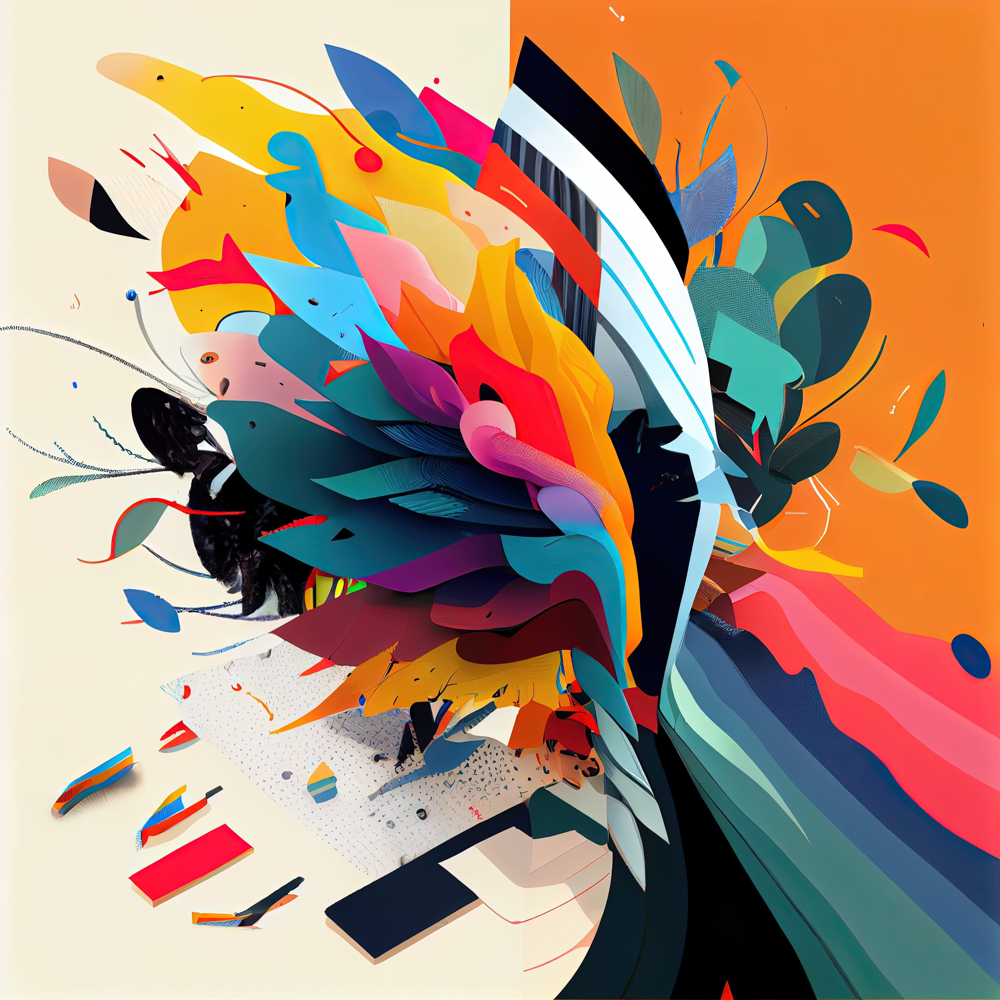

# Design as a Means of Managing Frustration 😫
### Frustration can be a difficult emotion to deal with, as it often arises from unmet expectations or obstacles that we cannot control. It can lead to feelings of anger, helplessness, and stagnation.

However, Design can provide a means of channeling and managing frustration in a constructive way. In this article, we’ll explore 10 tips for using Design as a tool for managing frustration.

Identify the source of frustration: The first step in managing frustration is to identify its source. Understanding the source of your frustration will help you to better target your design solutions.

- **Use color to represent emotions:** Color can be a powerful tool for representing emotions and helping to process them. Red and orange can represent feelings of frustration and anger, while cooler colors like blue and green can represent a sense of calm and balance.
- **Play with shape and form:** Shape and form can also be used to represent emotions and help to process them. Sharp, jagged shapes can represent feelings of frustration, while rounded and organic shapes can represent a sense of calm and resolution.
- **Use imagery that represents overcoming obstacles:** Rather than avoiding imagery that represents frustration, consider using imagery that represents overcoming obstacles. Images of a person climbing a mountain or breaking through a barrier can represent the idea of perseverance and triumph.
- **Use storytelling:** Storytelling can be a powerful tool for understanding and processing frustration. By using design elements like typography, imagery, and color to tell your story, you can create a sense of understanding and closure.
- **Use positive affirmations: Positive** affirmations can help to change negative thought patterns and boost self-esteem. Incorporating positive affirmations into your design can help to counteract feelings of frustration and promote a sense of determination.
- **Incorporate symmetry:** Symmetry can create a sense of balance and stability that can help to process feelings of frustration. By incorporating symmetry into your design, you can create a sense of order and balance.
- **Use asymmetry:** Asymmetry can also be a powerful tool for managing frustration. By breaking the rules and creating unexpected and unique designs, asymmetry can create a sense of surprise and intrigue that can help to process feelings of frustration.
- **Create a sense of movement:** Movement can also be used to represent emotions and help to process them. Incorporating movement into your design, whether it’s through animation or dynamic layouts, can create a sense of energy and vitality.
- **Use typography to create a sense of authority:** Typography can also be used to evoke emotions and promote a sense of determination. Using bold and confident font styles can create a sense of authority and power that can counteract feelings of frustration.

Design can be a powerful tool for managing frustration. By understanding the source of your frustration and using design elements like color, shape, imagery, storytelling, and typography, you can create designs that represent and help to process your emotions. Try out these tips and see how Design can help you to manage frustration and lead a more fulfilling life.
------------
## Exerpt
Use Design as a means of channeling and managing frustration in a constructive way
## Description
Tips and strategies to manage frustration by using Design, from identifying the source, use of color, shape, imagery and storytelling to positive affirmations, symmetry and asymmetry, movement and typography.
## Media

------------
- **Slug:** design-for-managing-frustration
- **Date:** 23/01/2023
- **URL:** [https://phixel.net/en/tips/mental-help/design-for-managing-frustration/](https://phixel.net/en/tips/mental-help/design-for-managing-frustration/)
- **Type:** [Blog](#blog)
- **Hashtags:** #graphicdesign #frustration #management #designthinking #emotiondesign #colorpsychology #shape #overcomingobstacles #storytelling #positivity #symmetry #asymmetry
- **Emojis:** 😔 😢 😞 😩 🎨 🤯 🛠 ‍♂ 💭 💡 🌟

------------
## Tags
[Graphic](#Graphic), [Design](#Design), [Emotion](#Emotion), [Therapy Stress](#Therapy Stress), [Management](#Management), [Mental](#Mental), [Wellness](#Wellness)
