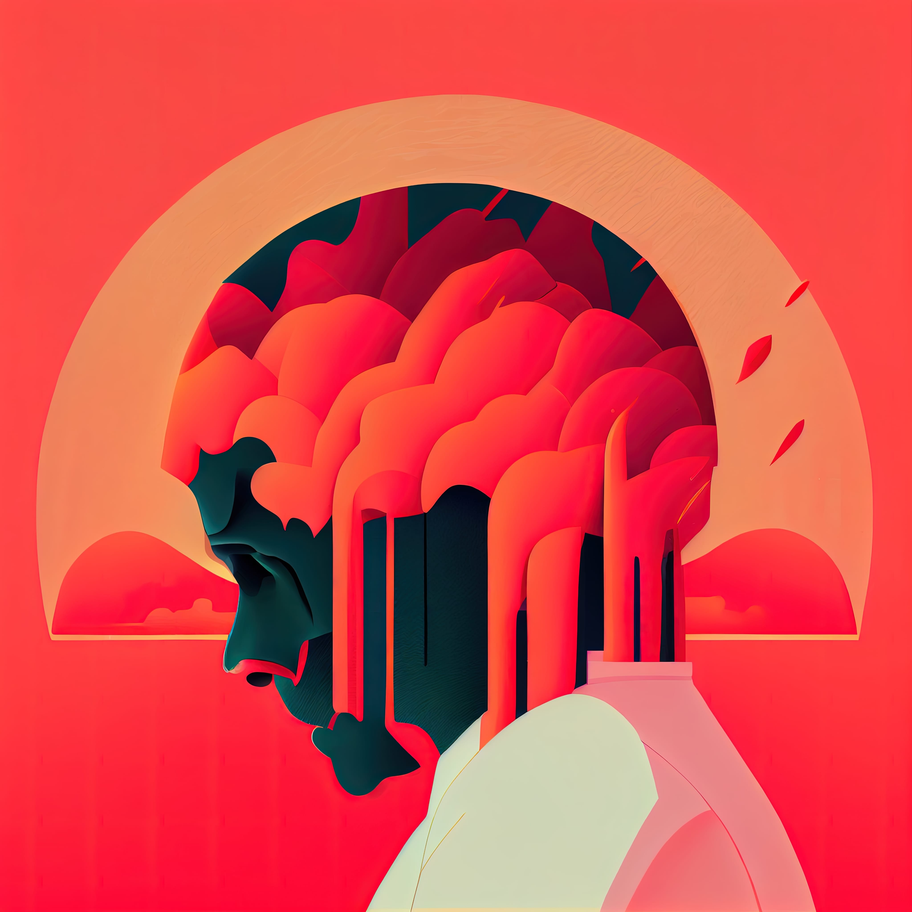

# 10 Ways graphic design can help alleviate anger 🤬
### Are you feeling angry and frustrated? Believe it or not, incorporating some graphic design techniques into your daily routine can actually help alleviate those negative emotions. From coloring to creating a vision board, here are 10 tips on how graphic design can help calm your anger.

- **Color Therapy:** Coloring has been proven to have a calming effect on the brain, making it a great tool for reducing anger. Try finding a coloring book or creating your own mandala designs to focus on while you take deep breaths and relax.
- **Create a Vision Board:** Use graphic design software to create a visual representation of your goals and aspirations. Focusing on what you want to achieve can help redirect negative energy and reframe your perspective.
- **Write It Out:** Use typography and text design to express your feelings in a healthy way. Write out your anger on paper or create a digital design using words and phrases that reflect your emotions.
- **Get Creative:** Engaging in creative activities, such as graphic design, can help channel your anger into something productive. Whether you’re drawing, painting, or designing on the computer, finding a creative outlet can provide a sense of accomplishment and release.
- **Mindfulness through Design:** Practicing mindfulness can be as simple as taking a few minutes to focus on the present moment. Use design elements like symmetry and balance to create a sense of calm and bring awareness to your surroundings.
- **Design for Self-Care:** Create a self-care plan using graphic design elements like calming colors and uplifting quotes. Use this design as a reminder to prioritize your mental health and take breaks when necessary.
- **Use Photography:** Look through your old photos or take new ones to create a positive visual reminder of happy memories. Incorporating photography into your design work can help bring a sense of nostalgia and joy.
- **Make a Gratitude List:** Use graphic design to create a list of things you are grateful for. Adding visual elements like illustrated icons or handwritten fonts can make the list more personal and meaningful.
- **Create a Mood Board:** A mood board is a collage of images and design elements that represent a certain emotion or theme. Use graphic design to create a mood board that showcases calm and peaceful imagery to help soothe your anger.
- **Practice Positive Affirmations:** Use graphic design to create positive affirmations and display them in a prominent place as a daily reminder to stay positive and reframe negative thoughts.

By incorporating some of these graphic design techniques into your daily routine, you can find relief from anger and frustration. Don’t underestimate the power of creativity and self-expression in managing your emotions.
------------
## Exerpt
If you're looking for more ways to incorporate graphic design into your self-care routine, be sure to check out the rest of our tips on how it can help alleviate anger.
## Description
Graphic design can be a powerful tool for managing negative emotions, such as anger. From coloring and creating a vision board, to practicing mindfulness and using positive affirmations, there are many ways to incorporate design techniques into your routine to help alleviate anger.
## Media

------------
- **Slug:** design-to-alleviate-anger
- **Date:** 02/01/2023
- **URL:** [https://phixel.net/en/activity/design/design-to-alleviate-anger/](https://phixel.net/en/activity/design/design-to-alleviate-anger/)
- **Type:** [Blog](#blog)
- **Hashtags:** #anger, #selfcare, #coloring, #visionboard, #typography, #creativity, #mindfulness, #selfcareplan, #photography, #gratitude, #moodboard, #affirmations
- **Emojis:** 😡 💢 🤬 😤 👿 💥 😠 😣 ❤️ 🥵 🎨 🖌

------------
## Tags
[ ](# )
