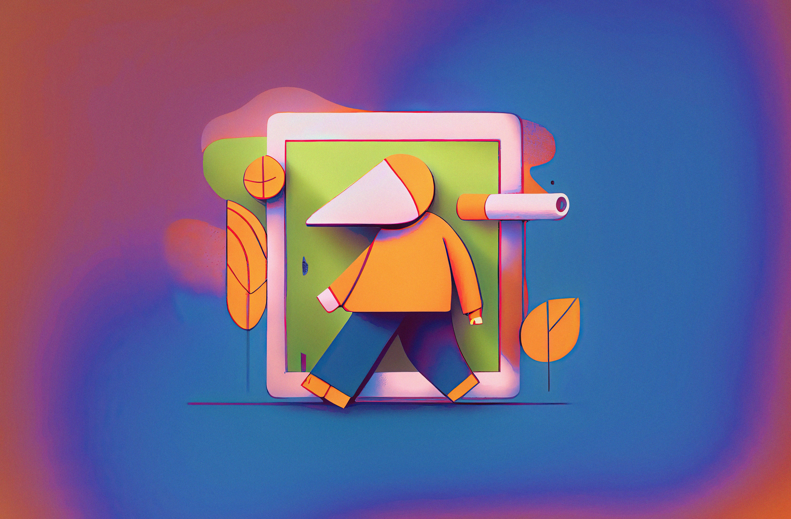

# 5 Tips for Successful Designers in the New Year 🎉
### As the new year begins, it’s a great time for designers to reflect on their past achievements and set goals for the year ahead. In this article, we’ll explore five tips that can help you succeed in the coming year, from setting goals and creating a marketing plan to staying up to date with industry trends and investing in your education and training.

1. **Set goals and objectives for the year:** Take some time at the beginning of the year to reflect on your past achievements and challenges, and set clear and specific goals and objectives for the year ahead. This will help you stay focused and motivated, and track your progress over time.
2. **Create a marketing plan:** Develop a comprehensive marketing plan that outlines how you will promote your business and reach new clients in the coming year. This can include tactics such as networking, social media marketing, content marketing, and advertising.
3. **Stay up to date with industry trends and developments:** The world of graphic design is constantly evolving, so it’s important to stay up to date with the latest trends and developments in the field. This can help you stay competitive, expand your skills, and stay inspired.
4. **Invest in your education and training:** Never stop learning! Consider investing in educational courses, workshops, or conferences to improve your skills and stay on top of the latest techniques and technologies. This will help you stay competitive and provide better services to your clients.
5. **Collaborate with other designers:** Collaborating with other designers can help you learn from their experiences, expand your network, and create unique and exciting projects. Consider reaching out to other

The new year is an exciting time for graphic designers, full of opportunities and challenges. By setting goals and objectives, developing a marketing plan, staying up to date with industry trends, investing in your education and training, and collaborating with other designers, you can position yourself for success and make the most of the coming year. So if you’re a graphic designer, take these tips to heart and start the year off on the right foot!

------------
## Exerpt
Start the new year off right with these tips for setting goals and achieving success as a graphic designer
## Description
As the new year approaches, it's a great time for graphic designers to set goals and plan for success. Follow these tips to kick off the new year on the right foot and achieve your professional goals in the year ahead.
## Media

------------
- **ID:** PA4Q
- **Date:** 1672527600
- **URL:** [https://phixel.net/en/tips/designers-in-new-year/](https://phixel.net/en/tips/designers-in-new-year/)
- **Type:** [Blog](#blog)
- **Emojis:** 🎉 🎊 📈 💡 📚 👩

------------
## Tags
[designergoals](#designergoals), [newyearnewyou](#newyearnewyou), [designerinspiration](#designerinspiration), [graphicdesigner](#graphicdesigner), [designerlife](#designerlife), [professionalgoals](#professionalgoals), [designertips](#designertips), [newyeardesign](#newyeardesign), [successfuldesigner](#successfuldesigner), [designeradvice](#designeradvice)
