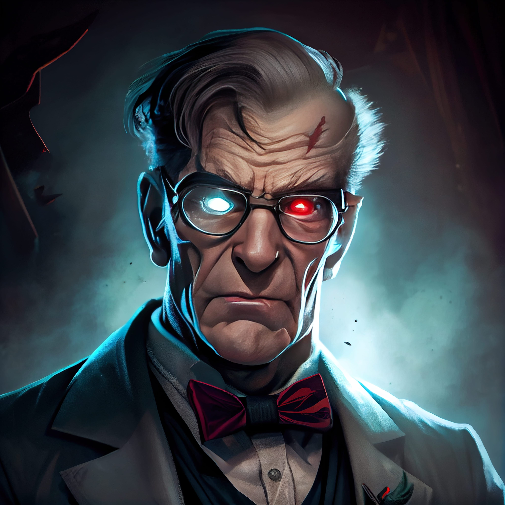

# Dr. Darkness Revenge 💣
### The streets of the city were dark and quiet, with only the sound of the wind rustling through the trees to break the silence. It was the perfect night for the villainous Dr. Darkness to carry out his evil plan.

For years, Dr. Darkness had been plotting to take over the world, and tonight was the night he would finally make his move. With a mad cackle, he activated his latest invention, a machine that would plunge the entire city into darkness.

But just as Dr. Darkness was about to celebrate his victory; a loud crash shook the building. The door to his lair burst open, and in walked Phixel, the city’s most powerful and skilled design agency.

“You may have your fancy machine, Dr. Darkness, ” said Phixel’s fearless leader, “but you can’t defeat the power of design!”

With that, Phixel unleashed their full arsenal of design skills, using their expertise in website design, logo creation, and branding to battle Dr. Darkness and his evil minions.

In the end, Phixel emerged victorious, and the city was saved from the clutches of the evil Dr. Darkness. And as the citizens cheered and celebrated, Phixel knew that they had proven once again that the power of design can save the day.
------------
## Exerpt
Join the fight against Dr. Darkness and his plan for revenge!
## Description
The evil Dr. Darkness plans to take over the city using a machine that plunges it into darkness. However...
## Media
 

------------
- **Slug:** dr-darkness-revenge
- **Date:** 03/06/2022
- **URL:** [https://phixel.net/en/dr-darkness-revenge/](https://phixel.net/en/dr-darkness-revenge/)
- **Short URL:** [https://bit.ly/3kUGY1G](https://bit.ly/3kUGY1G)
- **Type:** [Blog](#blog)
- **Hashtags:** #villain, #darkness, #revenge, #evil, #power, #horror, #mystery, #thriller
- **Emojis:** 😈💣😠🗡️🦹🏾🛡️🌎🖤🌑⚫🌆🥷🏾🌖🕍

------------
## Tags
[Darkness](#darkness), [Revenge](#revenge), [Fight](#fight), [Evil](#evil), [Plan](#plan), [Machine](#machine), [City](#city), [Power](#power), [Design](#design), [Victory](#victory)
