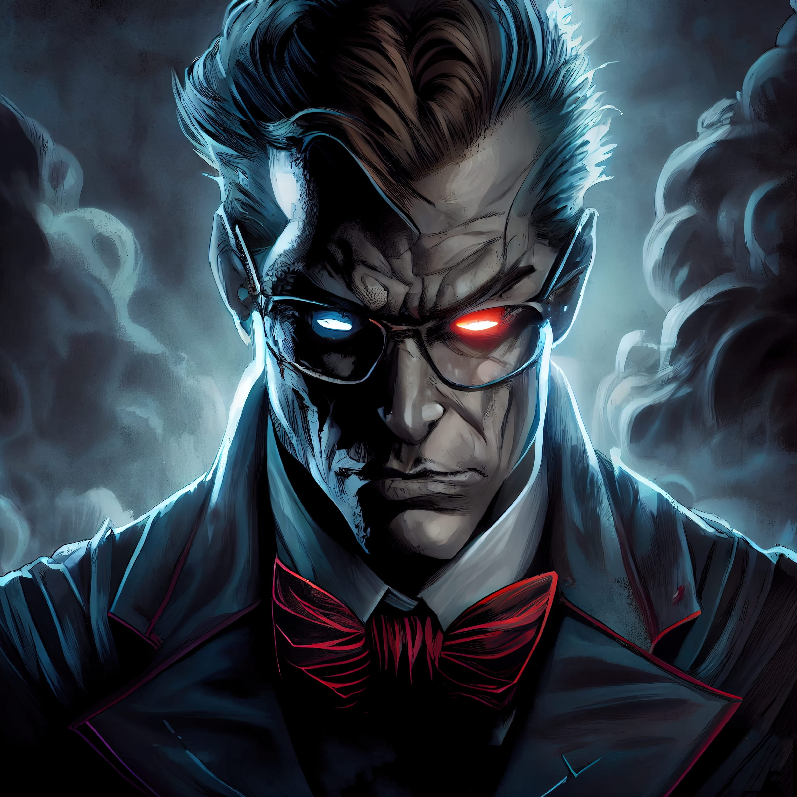

# Dr. Darkness 🦹🏾
### As the sun set over the city, the streets began to empty and the lights flickered on in the buildings. But one man was still awake, working tirelessly in his laboratory deep beneath the city.

His name was Dr. Darkness, and he was a mad scientist with a thirst for power. For years, he had been working on a secret project, a weapon that would give him control over the entire city.

But just as he was about to activate his weapon, a team of heroes burst into his laboratory. They were the members of Phixel, a design agency with the ability to create anything with their minds.

Dr. Darkness was horrified as he watched the heroes use their powers to destroy his weapon and foil his plans. But he was not defeated yet. With a maniacal laugh, he unleashed his army of robots and began to attack the heroes.

But Phixel was ready for him. Using their incredible design skills, they created a giant robot to battle Dr. Darkness’s army. The fight was fierce, but in the end, the heroes emerged victorious.

Dr. Darkness was defeated, and the city was saved thanks to the heroic efforts of Phixel. The people celebrated their victory, and the heroes were hailed as heroes. The design agency had once again proved that their creativity was a powerful force for good.
------------
## Exerpt
Experience the terror of Dr. Darkness and his plans for world domination!
## Description
Dr. Darkness is a mad scientist with a thirst for power who has been working on a secret project to gain control over the city. Just as he is about to activate his weapon...
## Media

------------
- **Slug:** dr-darkness
- **Date:** 03/03/2022
- **URL:** [https://phixel.net/en/story/mystery/dr-darkness/](https://phixel.net/en/story/mystery/dr-darkness/)
- **Type:** [Blog](#blog)
- **Hashtags:** #villain, #DrDarkness, #darkness, #worlddomination, #evil, #power, #horror, #mystery, #thriller
- **Emojis:** 😈🦹🏾🌎🖤🌑⚫🌆🥷🏾🌖🕍

------------
## Tags
[Terror](#terror), [Power](#power), [Domination](#domination), [Scientist](#scientist), [Weapon](#weapon), [Heroes](#heroes), [Phixel](#phixel), [Robot](#robot), [Defeat](#defeat), [Victory](#victory)
