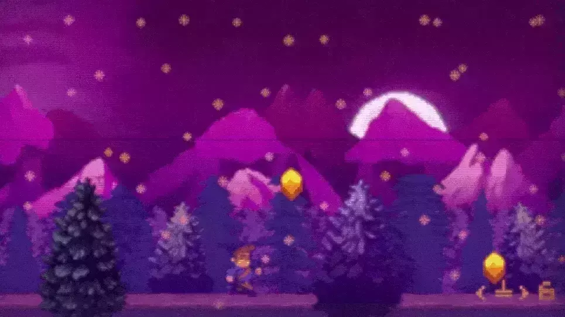

# Remember those dreamy pixelscapes? 🎮
Revisit the childhood memories of hours spent on your couch playing games in front of the TV.

[Remember those dreamy pixelscapes? 🎮](https://youtu.be/7nu1ImwCeDI)

We know that spending hours playing video games on your couch can be the best thing in the world.

## We've come a long way since then

We made an HTML Demo version for you to enjoy those nostalgic dreamy pixelscapes on the snowy mountain and the side-scrolling nostalgia of yesterday.

### [Sidescrolling the Mountain](https://codepen.io/The_Phixel/pen/qBYvaLJ)
------------
## Exerpt
Remember when you could spend hours playing pixelated video games in front of the TV?
## Description
Remember those dreamy pixelscapes that captured your imagination and made you feel like you were in a different world?
## Media

------------
- **ID:** 23P4
- **Date:** 01/01/2022
- **URL:** [https://phixel.net/en/dreamy-pixelscapes/](https://phixel.net/en/dreamy-pixelscapes/)
- **Type:** [Blog](#blog)
- **Emojis:** 🆒 🎮 🕹 ️⌨ 💾 🎹 ​​ 🍄 🅸

------------
## Tags
[the90s](#the90s), [pixelart](#pixelart), [retrogaming](#retrogaming), [nostalgia](#nostalgia), [HTML5game](#HTML5game), [pixelartgames](#pixelartgames), [pixelartdemo](#pixelartdemo), [psx](#psx), [nintendo64](#nintendo64), [supernes](#supernes), [gameboy](#gameboy), [gameboycolor](#gameboycolor), [nes](#nes), [snes](#snes), [pokemon](#pokemon), [snesforever](#snesforever), [psxforever](#psxforever), [retrogaming](#retrogaming), [videogame](#videogame)
