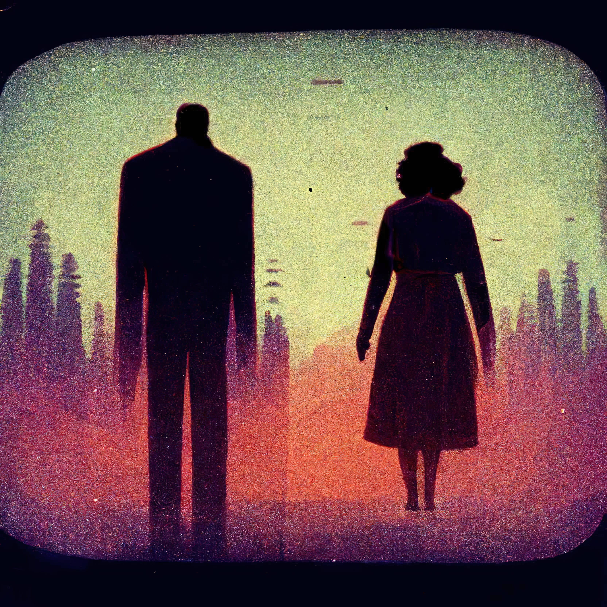
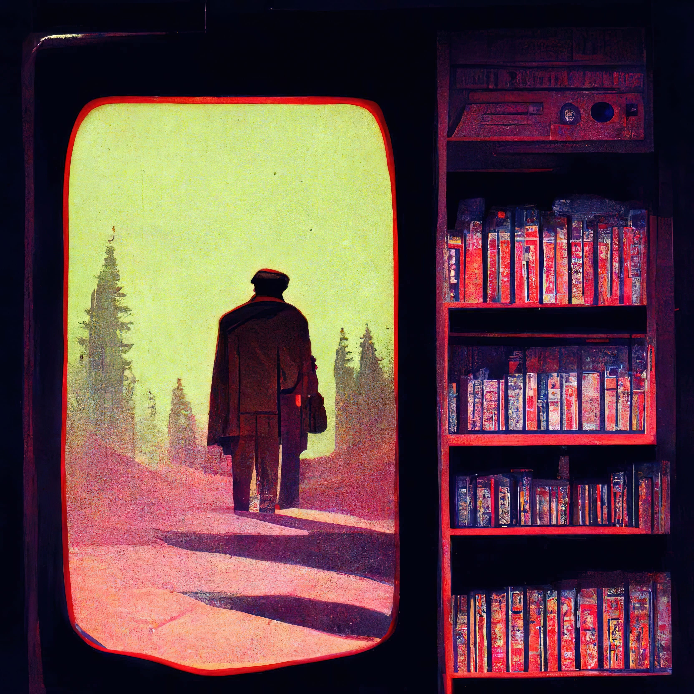

# The Pumpkin Hunter’s Curse 🎃
While a fearless local private detective, **Plisk**, investigates the disappearance of a young man named **Hunter** and his sister, he discovers a legend about an orange pumpkin with a supernatural curse found in an unknown location.

> "As soon as someone sees the Pumpkin, they have exactly 3 days left before their presence fades."

2 days ago, **Hunter** gets hold of the pumpkin that he heard about the legend, but refuses to believe in the superstition. Without realizing it, a sequence of images comes to mind:

> "The orange pumpkin swinging, in his eyes you can see a private detective, an old newspaper headline about an apocalyptic accident and a cold place."

When Hunter notices that he has a severe headache and that his eyes have the same properties as the pumpkin, he realizes that the curse is real and goes to his sister, a VHS fixer named Jenna to help him with the problem.

Jenna feels that the orange pumpkin is particularly creepy, she examines it, and involuntarily submits herself to the curse, the same visions flashing before her eyes. Unknowingly, she joins an unfortunate supernatural future...

Hunter and Jenna go on a quest to discover the meaning of the visions and find a cure for the curse.

At this moment, Plisk follows the trail of the youngsters, entering a cold room…

### Will they be able to stop the curse before the time runs out?
------------
## Exerpt
As soon as someone sees the Pumpkin, they have 3 before an unfortunate supernatural future occurs.
## Description
A private detective named Plisk investigates the disappearance of a young man named Hunter and his sister. While investigating, he discovers a legend about an orange pumpkin with a supernatural curse.
## Media

<audio controls><source src="media/a3fdcd2b/the-pumpkin-hunters-curse.mp3" type="audio/mp3"></audio>
------------
- **Slug:** pumpkin-hunter
- **Date:** 31/10/2022
- **URL:** [https://phixel.net/en/pumpkin-hunter/](https://phixel.net/en/pumpkin-hunter/)
- **Type:** [Blog](#blog)
- **Hashtags:** #halloween, #scary, #halloweenparty, #halloweenpumpkin, #spooky, #candy, #sweets, #pumpkin, #orangepumpkin, #curse, #legend, #supernatural, #disappearance, #hunter, #detective, #horror, #investigator, #apocalypse, #legends, #privateinvestigator, #vhs, #vhsfixer, #mystery, #suspense
- **Emojis:** 🙀🎃📺​👫📰🕵​🧥🕯🔍💀🕙🕸️​​​📼​⏮️​⏭️⏯️

------------
## Tags
[ ](# )
