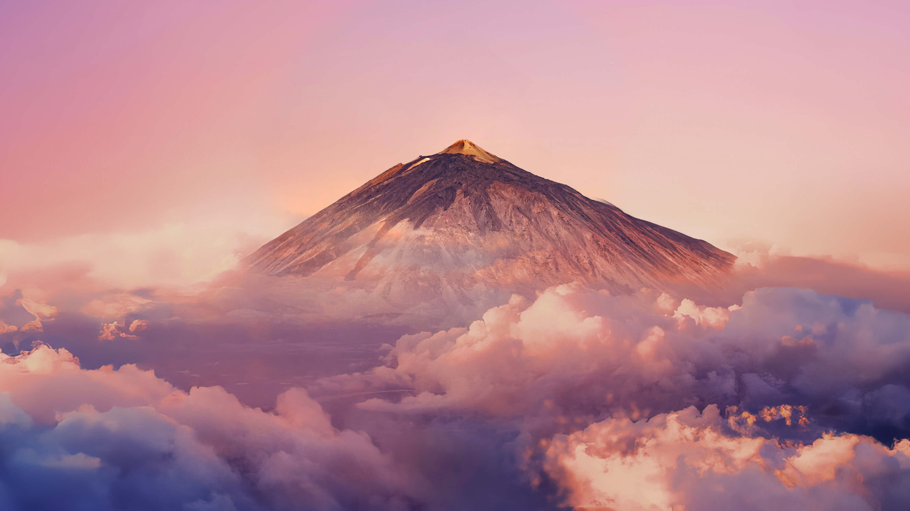

# Take a breath of fresh air with your favorite mountain, give your self a relaxing feel with the clouds 🗻
Mountains may be the highest natural things in our world, they do have a great beauty and splendor. As humans we tend to be fascinated by big things, you start thinking of peace, calm and relaxation.

So, it is not just a place but a moment, a moment that gives us all something special. When you have a moment to sit and watch the clouds, it is a great thing.

In some places they are just there as part of the scenery but in other places they have become an attraction for photographers and nature lovers alike. They are also used as an artistic tool to create incredible photos or paintings. Mountains are like clouds in the sense that: they are tall and evocative.

_The cloudy horizon approaches the water, she was reflected in the cool surroundings._
_She had always loved the soothing pink valley with its slowly fluffy sky. It was a place where she felt fascinated._
_A noble spirit with strong but pretty limbs. Her friends saw her as a gentle giant. Once, she had even saved a kind planet that was stuck in a drought. That’s the kind of spirit she was._
_Once she saw something in the distance, or rather, someone. A figure, a mountain, a modest caretaker with pink and big grounds._
_As the cloudy horizon and the mountain approached each other, a twinkle in her eyes could be seen, affectionately she quietly said “I love your peace.”_
_They looked at each other with a sense of relaxation, like two siblings, “I feel the same!” revealed the mountain with a delighted smile._

------------
## Exerpt
Take a breath of fresh air with your favorite mountain, give your self a relaxing feel with the clouds.
## Description
As you sit and watch the clouds drift by, you can feel the stress and worries of the world melt away. The pink mountain in the distance adds to the peaceful and calming atmosphere, making it the perfect place to relax and unwind.
## Media

------------
- **ID:** 9XG4
- **Date:** 1609455600
- **URL:** [https://phixel.net/en/skyline-clouds/](https://phixel.net/en/skyline-clouds/)
- **Type:** [Blog](#blog)
- **Emojis:** 🍂 🗻 🌄 🍃 🪂 ☁️ ♾️ 😮

------------
## Tags
[skyline](#skyline), [cloudsloops](#cloudsloops), [loop](#loop), [mountain](#mountain), [breathe](#breathe), [relax](#relax), [clouds](#clouds), [beauty](#beauty), [calm](#calm), [calming](#calming), [nature](#nature)
