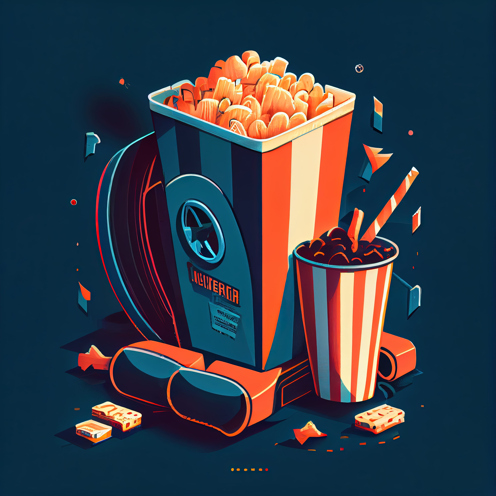

# Watching Movies Can Boost Your Design Skills 🎞️
### As designers, we are constantly seeking inspiration and ways to improve our skills.

While we may often look to other design work for inspiration, have you ever considered the potential of movies as a source of inspiration and learning? In this article, we’ll explore how movies can inspire and improve your design skills, from composition and color theory to storytelling and character development.

1. **Use movies to explore different composition techniques and principles:** To become a better designer, one effective technique is to use movies as a learning tool. By exploring the various composition techniques and principles used in film, you can gain a better understanding of how to create visually appealing designs.
2. **Pay attention to color theory and how it is used in movies to create mood and atmosphere:** When watching movies, pay attention to how color theory is used to create mood and atmosphere. Consider how different color schemes can impact the overall tone of a scene, and how they can be used to convey emotions and messages to the audience.
3. **Consider how movies use typography and text to convey information and emotion:** In addition to color theory, pay attention to the way movies use typography and text to convey information and emotions. Notice how the font, size, and placement of text can impact its effectiveness in communicating a message or evoking a specific response from the audience.
4. **Observe how movies use lighting and special effects to enhance their visual storytelling:** Another important aspect of design in movies is lighting and special effects. Observe how these elements are used to enhance the visual storytelling, and consider how you can use them in your own designs to create a similar impact.
5. **Look for examples of effective character design and development in movies:** take note of the character design and development in movies. Look for examples of effective character design and think about how you can apply those techniques in your own work to create memorable and engaging characters.
6. **Use movies to learn about storytelling and how to create engaging narratives:** use movies as a source of inspiration for your own design work. Look for examples of creativity and originality in film, and use them as a starting point to push the boundaries of your own designs and come up with unique and innovative ideas.
7. Take inspiration from the creativity and originality of movies to push the boundaries of your own design work.

Movies can be a rich source of inspiration and learning for designers. By watching movies with a critical eye and considering how they use composition, color, typography, and other design elements, you can improve your own design skills and create even more engaging and impactful work. So next time you’re looking for design inspiration, consider turning to the silver screen for some fresh ideas and inspiration.
------------
## Exerpt
Discover how movies can inspire and improve your design skills, from composition to color theory.
## Description
Movies can improve design skills by serving as a source of inspiration and learning. Designers can analyze movie elements such as composition, color theory, typography, lighting, character development, and storytelling to gain new insights and ideas. By paying attention to these elements in movies and using them in their own work, designers can improve their skills and create more engaging designs.
## Media
 

------------
- **Slug:** watching-movies-to-boost-skills
- **Date:** 13/02/2023
- **URL:** [https://phixel.net/en/activity/design/watching-movies-to-boost-skills/](https://phixel.net/en/activity/design/watching-movies-to-boost-skills/)
- **Short URL:** [https://bit.ly/3mwQjgB](https://bit.ly/3mwQjgB)
- **Type:** [Blog](#blog)
- **Hashtags:** #movies, #designinspiration, #designskills, #composition, #colortheory, #storytelling, #characterdevelopment, #movieinspiration, #designerslife
- **Emojis:** 🎬🎥💡🎨🎭🎥🌈🎞️🎨🎪😊😁😎😍🤩😜😝😏😉😆

------------
## Tags
[Atmosphere](#atmosphere), [Character Design](#character-design), [Color Theory](#color-theory), [Composition](#composition), [Design](#design), [Emotion](#emotion), [Lighting](#lighting), [Mood](#mood), [Storytelling](#storytelling), [Typography](#typography)
