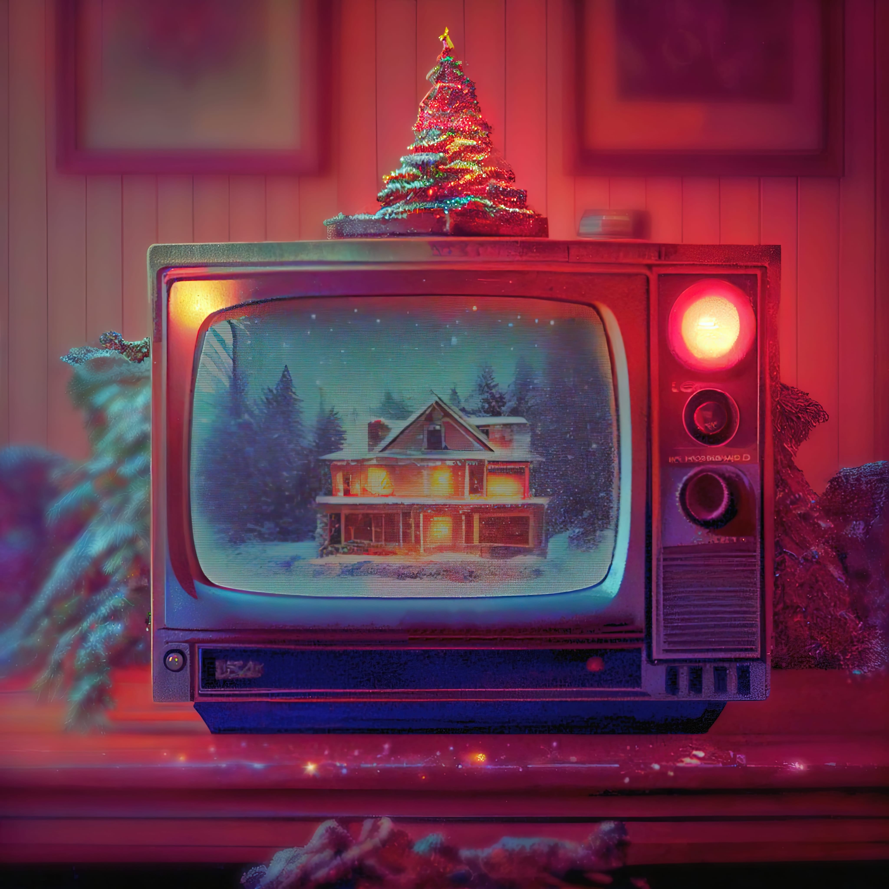

# Welcome Christmas 🎄
## Has everyone thought about their wish list?

If not, now is the time to start!
Keeping it simple is always better!

#### It’s the most wonderful time of the year – Christmas is here! As we start to prepare for the holiday season, one of the most exciting things to think about is our wish lists. What gifts do we hope to receive? What do we want to give to others? In this article, we will explore some tips for creating the perfect Christmas wish list.

1. **Start early:** Don’t wait until the last minute to start thinking about your wish list. Start early and give yourself plenty of time to think about what you really want.
2. **Be specific:** Don’t just say “I want a new phone” or “I want a new book.” Be specific and include details about the specific phone or book that you want. This will help the person giving the gift to know exactly what you want.
3. **Be realistic:** It’s important to be realistic when making your wish list. Don’t ask for something that is impossible to get or that is too expensive.
4. **Include a mix of things:** Your wish list should include a mix of things, from practical items that you need to fun and unique items that you want.
5. **Share your list:** Once you have your list ready, share it with the people who will be giving you gifts. This will help them to know what you want and to avoid getting you something that you already have or don’t want.

Creating the perfect Christmas wish list is an exciting and fun part of the holiday season. By starting early, being specific, being realistic, including a mix of things, and sharing your list, you can create a wish list that will help you get the gifts that you really want.

### It’s that time of year and we can’t wait to receive some cool gifts.
------------
## Exerpt
It's that time of year and we can't wait to receive some cool gifts. Has everyone thought about their wish list? If not, now is the time to start! Keeping it simple is always better!
## Description
It's definitely exciting to think about what gifts we might receive during the holiday season! If you haven't already started making your wish list, now is a great time to start. Here are some tips for keeping it simple
## Media

------------
- **ID:** 3H2Y
- **Date:** 01/12/2022
- **URL:** [https://phixel.net/en/welcome-christmas/](https://phixel.net/en/welcome-christmas/)
- **Type:** [Blog](#blog)
- **Emojis:** 🎁 🎅 🏻 🎄 🦌 ❄️ 🤶 🏽 🛷 ☃️ 🥂 👨 👧 ️

------------
## Tags
[christmas](#christmas), [christmastree](#christmastree), [christmasgifts](#christmasgifts), [xmas](#xmas), [wishlist](#wishlist), [instagood](#instagood), [gift](#gift), [wishing](#wishing), [wishes](#wishes)
