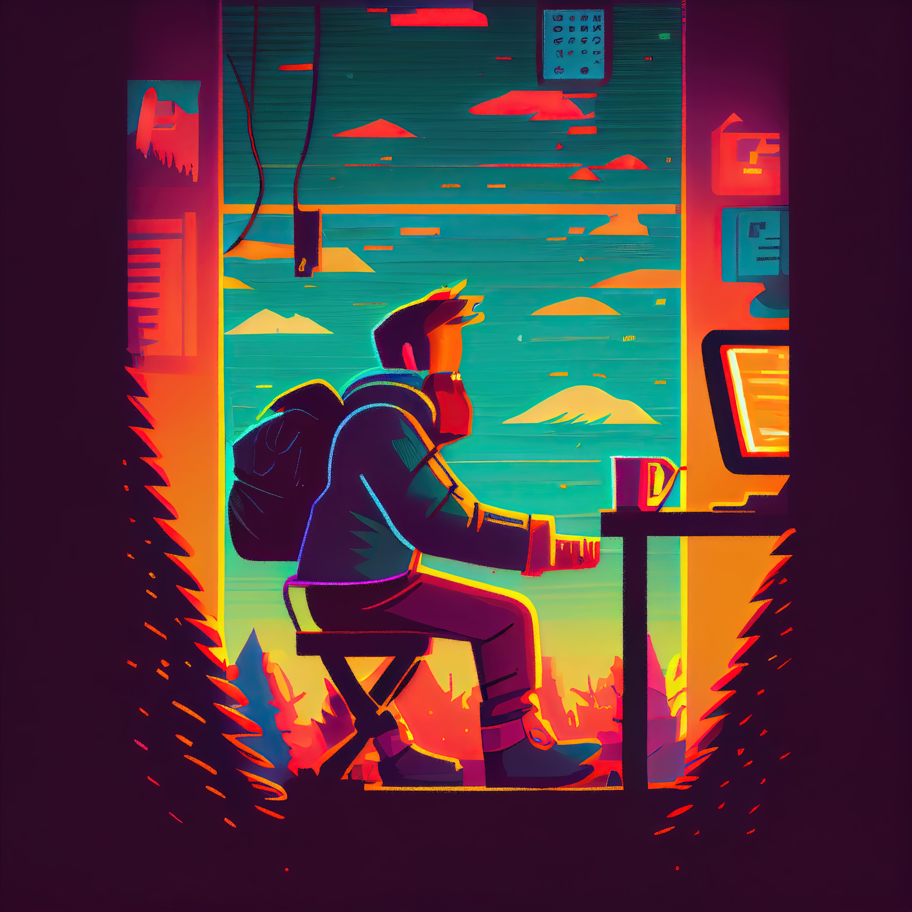

# Let’s Create a Side-Scrolling Game in HTML (Part 1) 🕹️
Side-scrolling games have been a favorite among gamers for decades. From classic games like **Super Mario Bros**. to modern titles like **Hollow Knight**, side-scrollers have remained popular throughout the years. In this article, we will discuss the essential elements that make a great side-scrolling game and provide a step-by-step guide on how to create one using HTML.

## Key Elements of a Great Side-Scrolling Game

### Engaging Gameplay Mechanics

The gameplay mechanics are one of the essential elements of a great side-scrolling game. The game should be easy to pick up, yet difficult to master. The gameplay should be engaging and enjoyable, with challenges that keep the player invested in the game. To achieve this, the game should have a variety of obstacles that require different skills and strategies to overcome.

### Stunning Visuals

Visually appealing graphics are another key element of a great side-scroller. The use of colors, lighting, and animation can significantly enhance the gameplay experience. The graphics should be unique and memorable, adding to the game’s atmosphere and overall feel.

### Compelling Storyline

A compelling storyline is another critical element of a great side-scroller. The story should add depth to the game’s world and be engaging enough to keep the player invested in the game. It should provide the player with a reason to keep playing and discover more about the game’s lore. Or alternatively, you may choose to ignore the story and focus solely on the awesome gameplay.

### Memorable Soundtrack

A memorable soundtrack is the final essential element of a great side-scroller. The music should be immersive and enhance the game’s atmosphere. The soundtrack can help to set the tone for the game and make it more memorable for players.

## Task List for Creating the game

1. **Set up the HTML and CSS:**
- Create a canvas element in the HTML where the game will be rendered.
- Use CSS to position and style the canvas.
- Add any necessary fonts or images to the page.
2. **Set up the game engine:**
- Choose a game engine that suits your project’s needs.
- Configure the game engine’s settings and features to optimize performance and meet your game’s requirements.
- Establish placeholders and a basic game structure, including platforms, gravity, traps, and characters.
- Test and debug the game engine to ensure it’s working as intended.
3. **Create the player character:**
- Use JavaScript to create a player object with properties like position, velocity, and acceleration.
- Add physics to the player object by updating its position based on its velocity and acceleration.
- Use the canvas API to draw the player object on the canvas.
4. **Create the platforms:**
- Use JavaScript to create an array of platform objects with properties like position and size.
- Use the canvas API to draw the platform objects on the canvas.
5. **Implement jumping and collision detection:**
- Use player input to apply a vertical impulse to the player object when the player jumps.
- Use collision detection to detect when the player collides with a platform.
- If the player collides with a platform, set the player’s vertical velocity to 0 and move the player to the top of the platform.
6. **Add scrolling:**
- Use JavaScript to move the platforms and player horizontally when the player moves to the edge of the screen.
- The camera should follow the player horizontally, but not vertically.
7. **Add scoring and game over:**
- Keep track of the player’s score based on how far they have traveled.
- End the game if the player falls off the bottom of the screen or collides with an obstacle.

This is a general framework for creating a side-scrolling game with physics using HTML. The exact details may vary based on the specific design of your game, including how the player interacts with the game world, how the player is animated, and how the scoring system functions. Nonetheless, this can serve as a useful starting point for developing your own game.

Join us for the next part of the article where we will be starting with “Set up the HTML and CSS”. Make sure to stay tuned and prepare yourself for the upcoming steps in creating your very own side-scroller game with physics in HTML. See you soon!
------------
## Exerpt
Learn how to set up a side-scrolling game with physics in HTML! Follow this basic outline to create your own game loop, player character, platforms, scrolling, and scoring. Read more to get started!
## Description
In this tutorial, you will learn the fundamental steps of creating a side-scrolling game with physics in HTML. You will set up a game loop, create a player character and platforms, implement jumping and collision detection, add scrolling, and implement scoring and game over. With this basic outline, you can start creating your own game, customized to your specific design and gameplay features.
## Media
 
 

------------
- **Slug:** side-scrolling-game-part-1
- **Date:** 01/02/2023
- **URL:** [https://phixel.net/en/devdiary/side-scrolling-game/](https://phixel.net/en/devdiary/side-scrolling-game/)
- **Short URL:** [https://bit.ly/3ZMXDD6](https://bit.ly/3ZMXDD6)
- **Type:** [DevDiary](#devdiary)
- **Hashtags:** #HTML, #CSS, #JavaScript, #GameDevelopment, #Physics, #CanvasAPI, #PlayerObject, #PlatformObjects, #CollisionDetection, #Scrolling
- **Emojis:** 🎮🕹️🌟👨‍💻📈🔧🎨🖌️🚀👾

------------
## Tags
[Canvas API](#canvas-api), [Collision Detection](#collision-detection), [CSS](#css), [Game Development](#game-development), [HTML](#html), [JavaScript](#javascript), [Physics](#physics), [Platform Objects](#platform-objects), [Player Object](#player-object), [Scrolling](#scrolling)
