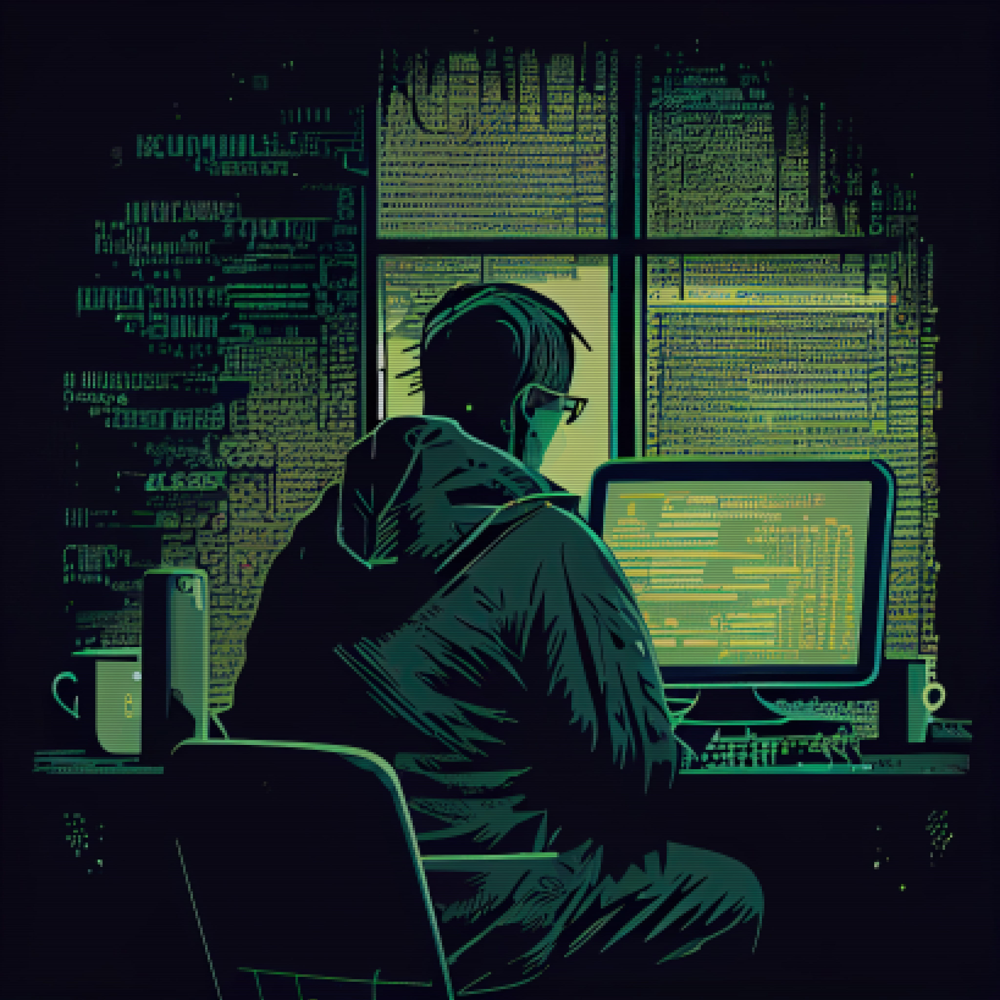

# Let’s Create a Game in HTML (Part 2) 🕹️ – Set up the HTML and CSS
### Get ready to jump into the fun world of game development!

Game development is an adventure that’s both thrilling and a bit overwhelming. But with the right plan and guidance, you’ll be on your way to creating an awesome game in no time!

That’s where we come in. In this article, we’ll walk you through the first part of our tutorial series on game development. Specifically, we’ll focus on setting up the HTML and CSS for your game, which is a crucial first step in creating an awesome game.

So, buckle up and let’s get started on this exciting journey together!

## Step 1: Let’s brainstorm our game idea!

#### First things first, we need a killer idea, and we’ve got one! Let’s introduce you to our game

### Super Jumper: Save Jumplandia!

**Jax**, our hero, embarks on an epic quest to save the peaceful **Kingdom of Jumplandia** from an army of vicious creatures who have stolen a sacred crystal. Armed with his trusty jumping skills, **Jax** journeys through the different worlds of **Jumplandia**, overcoming various challenges and obstacles to restore peace to his beloved kingdom.

## Step 2: Let’s Get Coding!

Now that we have our awesome story, it’s time to bring it to life by creating our HTML and CSS. The first step in building a game is to design the layout and structure of our web page. So, let’s dive in and create our index.html file with a basic structure

#### A Simple Structure to Get Us Started

```html
<!DOCTYPE html>
<html>
<head>
<!-- Add any necessary meta tags or external stylesheets here -->
</head>
<body>
<!-- The fun starts here! Let's add some game elements -->
<footer></footer>
</body>
</html>

```

Now we’re ready to add some exciting game features and bring our hero, Jax, to life!

#### Let’s Make Our Game Stand Out with an Awesome Header!

First impressions matter, so let’s give our game a memorable header that players won’t forget. We’ll start by adding some basic SEO information, including the title and description of the game. Here’s an example code that you can use as a starting point:

```html
<head>
<!-- Set the character set and viewport -->
<meta charset="UTF-8">
<meta name="viewport" content="width=device-width, initial-scale=1.0">

<!-- Set the page title and description -->
<title>Super Jumper: Save Jumplandia!</title>
<meta name="description" content="Get ready to jump into a world of adventure with Super Jumper!">

<!-- Include the custom scripts -->
<script src="scripts/functions.js"></script>
<script defer src="scripts/game.js"></script>

<!-- Include the stylesheet -->
<link rel="stylesheet" href="css/styles.css" />
</head>

```

With this code, we’ve set up the basic structure of our HTML file, added some essential SEO information, and included the custom scripts and stylesheets that we’ll need for our game. Note that we added some JavaScript and CSS for future use. Now, to create the game container, we’ll add a

element with an id of “game” in the body of the HTML file. This will allow us to target this element with CSS and JavaScript to style and control the game.

```html
<!-- Create a game section for the game canvas -->
<div id="game"></div>

```

Now that we have our game container set up, it’s time to add some flavor and information to our game! We’ve decided to include a navigation sidebar with some options, such as play/restart, access to the game story as a popup, and more information about the game. However, feel free to get creative and make your own sidebar that suits your game. In our final release, we added even more text, but for now, we’ll keep it simple. Let’s jump into the code and bring some life to our game!

```html
<!-- Create a navigation sidebar -->
<nav class="sidebar">

<ul>
<li><a href="#story">Story</a></li>
<li><a href="#about">About</a></li>
<li><a href="#reset">Reset Game</a></li>
<li><a href="#sound">Toggle sound</a></li>
</ul>
</nav>
<!-- Set the game story -->
<article id="story">
<h1>Super Jumper: Save <b>Jumplandia</b>!</h1>
<p>
Welcome to Super Jumper, a platformer game that will have you jumping in world full of surprises!
you waiting for?
</p>
</article>
<!-- Set the page info -->
<article id="about">
<h2>About Super Jumper</h2>
<p>
The game was built using HTML, CSS, and JavaScript, 
making it easy for anyone to understand the game.
</p>
</article>
<!-- Create a game section for the game canvas -->
<div id="game"></div>

```

**Don’t forget to give your footer some love!** Without it, our hero might just fall on its head before the adventure even begins.

```html
<!-- Create a footer for the page -->
<footer>
<span title="Copyright">©</span> All rights reserved
</footer>

```

## Step 3: Adding Some Style!

Great job on setting up the HTML structure for your game! Now, let’s make it look good with some CSS.

Let’s organize our CSS files by creating a new folder called “styles”. In that folder, we can create a CSS file to store all of our general CSS functions for the page. Let’s name it “styles.css” for simplicity.

We love retro-inspired colors, so let’s use some 80s-inspired colors to give our game some personality. We’ll cover all the basics with black, white, yellow, blue, red, orange, green, purple, and of course, neon pink. Let’s create global root variables for these colors to make it easier to apply them throughout the CSS file, we will save these colors in a file called “colors.css”.

```css
:root {
--black: #000300;
--white: #fffeff;
--gray: #808191;
--yellow: #faff00;
--blue: #3a86ff;
--red: #ff006e;
--green: #89fc00;
--orange: #fb5607;
--purple: #8338ec;
--pink: #f560e2;
--cyan: #73d2de;
--magenta: #ff206e;
}

```

But wait, there’s more! We’re going to take it to the next level by adding tones of light and dark. With a little creativity, your game will be the talk of the town.

So let’s get started, grab your brushes and let’s paint a masterpiece!

```css
:root {
/* Gray color palette */ --black: #000300; --white: #fffeff; --gray: #808191; --gray-dark: #5b5d69; --gray-light: #a9a9b5;
/* Yellow colors */ --yellow: #faff00; --yellow-dark: #b3a700; --yellow-light: #edff4d;
/* Blue colors */ --blue: #3a86ff; --blue-dark: #006fed; --blue-light: #87abff;
/* Red colors */ --red: #ff006e; --red-dark: #b3005c; --red-light: #ff4d8b;
/* Green colors */ --green: #89fc00; --green-dark: #6eb000; --green-light: #9dff4a;
/* Orange colors */ --orange: #fb5607; --orange-dark: #b32d03; --orange-light: #fc9752;
/* Purple colors */ --purple: #8338ec; --purple-dark: #4e13c5; --purple-light: #b87ef3;
/* Pink colors */ --pink: #f560e2; --pink-dark: #f018e7; --pink-light: #faa8e8;
/* Cyan colors */ --cyan: #73d2de; --cyan-dark: #35cbcf; --cyan-light: #b1e1ed;
/* Magenta colors */ --magenta: #ff206e; --magenta-dark: #d3005b;
}

```

Let’s take our color choices to the next level and make things even easier by setting up some classes to work with these colors. We can create classes for text, borders, and other elements to help keep things organized and consistent. And to make our lives even easier, we’re going to use LESS (but feel free to use SASS or any other CSS preprocessor of your choice).

Alright, let’s see what we’re working with! Take a look at this code featuring the lovely color pink as an example. This will give you a good idea of what your code should look like.

```css
/* Pink colors */
.pink-tx { color: var(--pink); }
.pink-tx-hv:hover { color: var(--pink) !important; }
.pink-bg { background-color: var(--pink); }
.pink-bg-hv:hover { background-color: var(--pink) !important; }
.pink-br{ border-color: var(--pink); }
.pink-br-hv:hover { border-color: var(--pink) !important; }

/* Light Pink colors */
.pink-tx.light { color: var(--pink-light); }
.pink-tx-hv.light:hover { color: var(--pink-light) !important; }
.pink-bg.light { background-color: var(--pink-light); }
.pink-bg-hv.light:hover { background-color: var(--pink-light) !important; }
.pink-br.light{ border-color: var(--pink-light); }
.pink-br-hv.light:hover { border-color: var(--pink-light) !important; }

/* Dark Pink colors */
.pink-tx.dark { color: var(--pink-dark) !important; }
.pink-tx-hv.dark:hover { color: var(--pink-dark); }
.pink-bg.dark { background-color: var(--pink-dark) !important; }
.pink-bg-hv.dark:hover { background-color: var(--pink-dark) !important; }
.pink-br.dark{ border-color: var(--pink-dark); }
.pink-br-hv.dark:hover { border-color: var(--pink-dark) !important; }

```

We should also reset our HTML styles to make sure our page looks consistent across all browsers. By doing this, we can focus on adding more custom styles to our game, lest save this code in a file named “reset.css”. So, let’s roll up our sleeves and dive into the fun part of CSS!

```css
/* Reset styles for the html and body elements */
html, body {
border: 0;
font-family: inherit, sans-serif;
line-height: 1.5;
margin: 0;
padding: 0;
}
/* Reset styles for various conteiner elements */
div, span, object, iframe, img, table, caption, thead, tbody, 
tfoot, tr, tr, td, article, aside, canvas, details, figure, hgroup, menu, 
nav, footer, header, section, summary, mark, audio, video {
border: 0;
margin: 0;
padding: 0;
}
/* Reset styles for specific text filled elements */
h1, h2, h3, h4, h5, h6, p, blockquote, pre, a, abbr, address, cite, code, 
del, dfn, em, ins, q, samp, small, strong, sub, sup, b, i, hr, dl, dt, dd, 
ol, ul, li, fieldset, legend, label {
border: 0;
font-size: 100%;
vertical-align: baseline;
margin: 0;
padding: 0;
}
/* Set specific big elements to display as block-level */
article, aside, canvas, figure, figure img, figcaption, hgroup, 
footer, header, nav, section, audio, video {
display: block;
}
/* Reset styles for tables */
table {
border-collapse: separate;
border-spacing: 0;
caption, th, td {
text-align: left;
vertical-align: middle;
}
}
/* Reset styles for images within links */
a img {
border: 0;
}
/* Reset styles for focus state */
:focus {
outline: 0;
}
/* Ensure that padding does not affect the with of an object */
*{
box-sizing: border-box;
}

```

Now that we’ve set up our base CSS files, let’s start doing the real part, lets save ourselves some time by setting the background color and text color.

```css
/* Set default for html and body */
html, body {
color: var(--gray);
background-color:var(--white);
}
/* Set link */
a{
color:var(--pink);
transition:color .5s;
}

a:hover{
color:var(--orange);
}

```

We’ll keep it simple and sweet for now, but trust us, your game is about to look amazing! Stay tuned for the next article, where we’ll dive into giving some love and style to your HTML. See you there!
------------
## Exerpt
Ready to create an awesome game? Learn how to set up the HTML and CSS for your game in this tutorial. Follow the steps and get started!
## Description
In this article, we introduce our game, Super Jumper: Save Jumplandia, and provide a step-by-step guide to set up the HTML and CSS for your game. We've included code snippets to help you along the way and added some essential SEO information. Buckle up and join us on this exciting journey to creating an awesome game!
## Media
<br>
<br>

------------
- **Slug:** side-scrolling-game-part-2
- **Date:** 10/03/2023
- **URL:** [https://phixel.net/devdiary/side-scrolling-game/html-and-css/](https://phixel.net/devdiary/side-scrolling-game/html-and-css/)
- **Short URL:** [https://bit.ly/3F1Jr0O](https://bit.ly/3F1Jr0O)
- **Type:** [DevDiary](#devdiary)
- **Hashtags:** #gamedevelopment, #HTML, #CSS, #webdevelopment, #tutorial, #howto, #beginnerfriendly, #javascript, #coding, #programming
- **Emojis:** 🎮💻🕹️👾🎨🚀📚💡🔧🌟

------------
## Tags
[Beginner Friendly](#beginner-friendly), [Coding](#coding), [CSS](#css), [Game Development](#game-development), [How-to](#how-to), [HTML](#html), [JavaScript](#javascript), [Programming](#programming), [Tutorial](#tutorial), [Web Development](#web-development)
