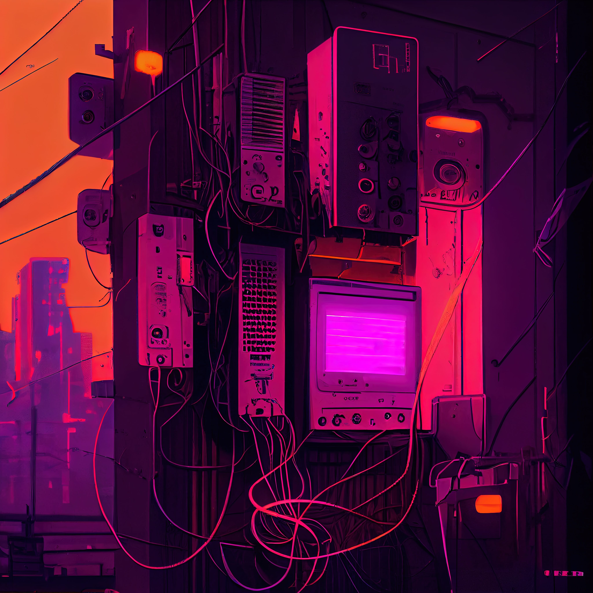

# Collaborating with Phixel as a Freelance Professional 💰
### Dear [user], 
## We hope you are doing well. Thank you for your interest in Phixel.
**We appreciate your time and effort in reaching out to us.**

In response to your inquiry, we would like to inform you that we are currently not hiring for a full-time [job] position. However, we are open to collaboration opportunities with freelance professionals on a project basis.

> We strive to connect with talents in Latin America and the US, but this is not a limiting factor for working together.

Our work model consists of agreeing on a fair value for the **completion of a specific part of a project**, as long as that value is compatible with the **budget established by the client**. If we reach an agreement, we will provide you with all the necessary materials and set realistic and adjusted deadlines before starting. We maintain open communication and make daily follow-ups if necessary to ensure that everything evolves correctly. The most important thing is for both of us to meet our responsibilities, so it is crucial that the **agreed dates are met**. Otherwise, we will have to cancel the work and look for other options.

We would greatly appreciate it if you could send us a portfolio of your previous work to get an idea of your skills and, if appropriate, explore the possibility of working together on a future project.

> This job is remote, meaning that you do not need to be in a specific physical location to collaborate with us.

**We hope we have been helpful and remain at your disposal for any other questions or inquiries.**

Sincerely, 
*The Phixel Team*
------------
## Exerpt
Ready to take your freelance career to the next level? Join Phixel's team of talented individuals and make your mark on the world! Apply now.
## Description
Phixel is is open to collaborating with freelance professionals on a project basis. We seek talented individuals and location is not a limiting factor. The work model involves agreeing on a fair value for project completion and providing necessary materials with adjusted deadlines. We require daily communication and expect both parties to meet responsibilities. Sending a portfolio of previous work is appreciated to explore the possibility of future collaboration.
## Media
 

------------
- **Slug:** freelance-collaboration
- **Date:** 01/01/2020
- **URL:** [ ]( )
- **Short URL:** [ ]( )
- **Type:** [Format](#format)
- **Hashtags:** #FreelanceCareer, #PhixelCollaboration, #TalentedIndividuals, #DedicatedTeam, #CreativeOpportunities, #ProjectBasis, #ValueForCompletion, #NecessaryMaterials, #RealisticDeadlines, #DailyCommunication
- **Emojis:** 🗝☕🕰📜🎞🖋️🧑‍🏭👩🏼‍💼👷🏿📄📗💻📘📖⁣📓📝🧰💵

------------
## Tags
[Freelance](#freelance), [Creative](#creative), [Career](#career), [Opportunities](#opportunities), [Talents](#talents), [Dedication](#dedication), [Collaboration](#collaboration)
