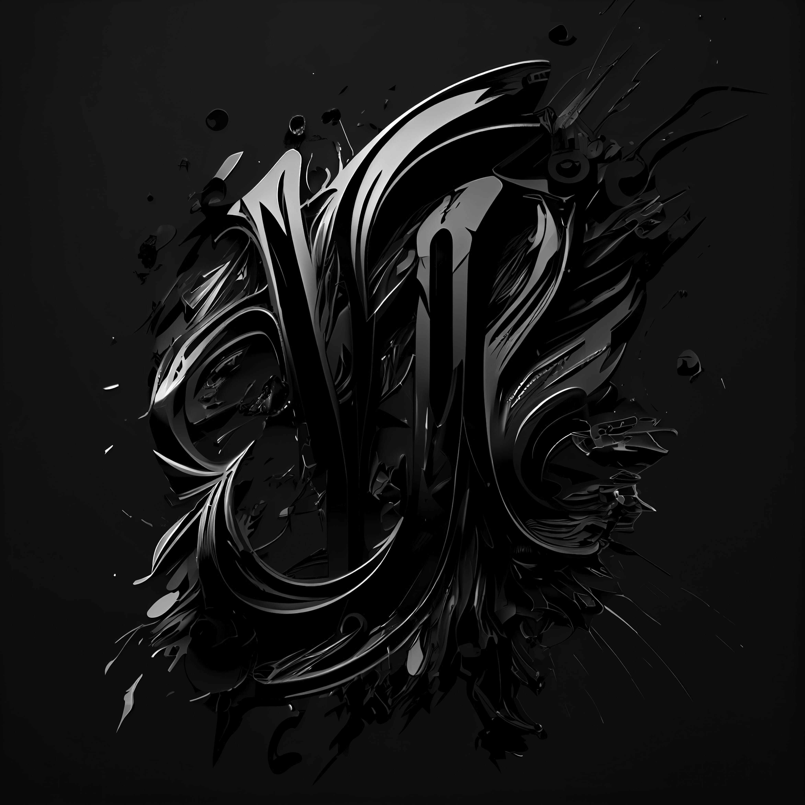

# Black Logos Collection Vol. 1 🖤
## Black is the new Black!
### Amazing collection of badass black logos
Welcome to the first installment of our new series on our logos.

In this series, we show our logo design. So whether you’re a fan of the color black or just looking for some inspiration, you’re sure to find it here!

We like to brag about our ability to design amazing things, check out some awesome and beautiful black logos we’ve created!
------------
## Exerpt
Black is the new Black!
Amazing collection of badass black logos
## Description
Welcome to the first installment of our new series on our logos.

We like to brag about our ability to design amazing things, check out some awesome and beautiful black logos we’ve created!

---

Welcome to our latest series on logos where
we showcase our amazing design abilities
we’ll be exploring the timeless and elegant
color black, will be showcasing a collection
of badass black logos that we’ve created
Whether you’re looking for inspiration for
your own logo design or simply appreciate
the beauty of black, you’re in for a treat!
Black is a color that never goes out of style.
It’s sleek, sophisticated, and powerful.
It’s no wonder that so many businesses and
brands choose to use black in their logos
Black can be used in so many different ways
in logo design. It can be used as the primary
color or as an accent color to add depth and
contrast and can be paired with almost any color, 
making it a great choice for brands that want
to experiment with different color combinations.
Thank you for watching.
We hope our collection has inspired you with our designs.
Follow us at
@the_phixel and https://phixel.net for more, 
remember links are in the description.
## Media
 
 
 
 
 
 
 
 
	<a href="media/18e61e2f/black-is-the-new-black.mp4" target="_media">mp4: black-is-the-new-black.mp4</a> 
	<a href="media/1d16d771/black-is-the-new-black-short.mp4" target="_media">mp4: black-is-the-new-black-short.mp4</a> 

------------
- **Slug:** black-logos
- **Date:** 03/12/2022
- **URL:** [https://phixel.net/en/gallery/black-logos/](https://phixel.net/en/gallery/black-logos/)
- **Type:** [Gallery](#gallery)
- **Hashtags:** #phixel, #logo, #blacklogos, #logos, #onyx, #ink, #blacklogo, #logoscollection, #darken, #pitchblack, #logodesign, #jetblack, #logocreative, #dark, #logocreator, #logoinspiration, #noire
- **Emojis:** 🖤🖤🖤🖤🖤🖤🖤▪️⚫👩🏿‍🦳◼️🖤🖤🖤🖤🖤

------------
## Tags
[ ](# )
