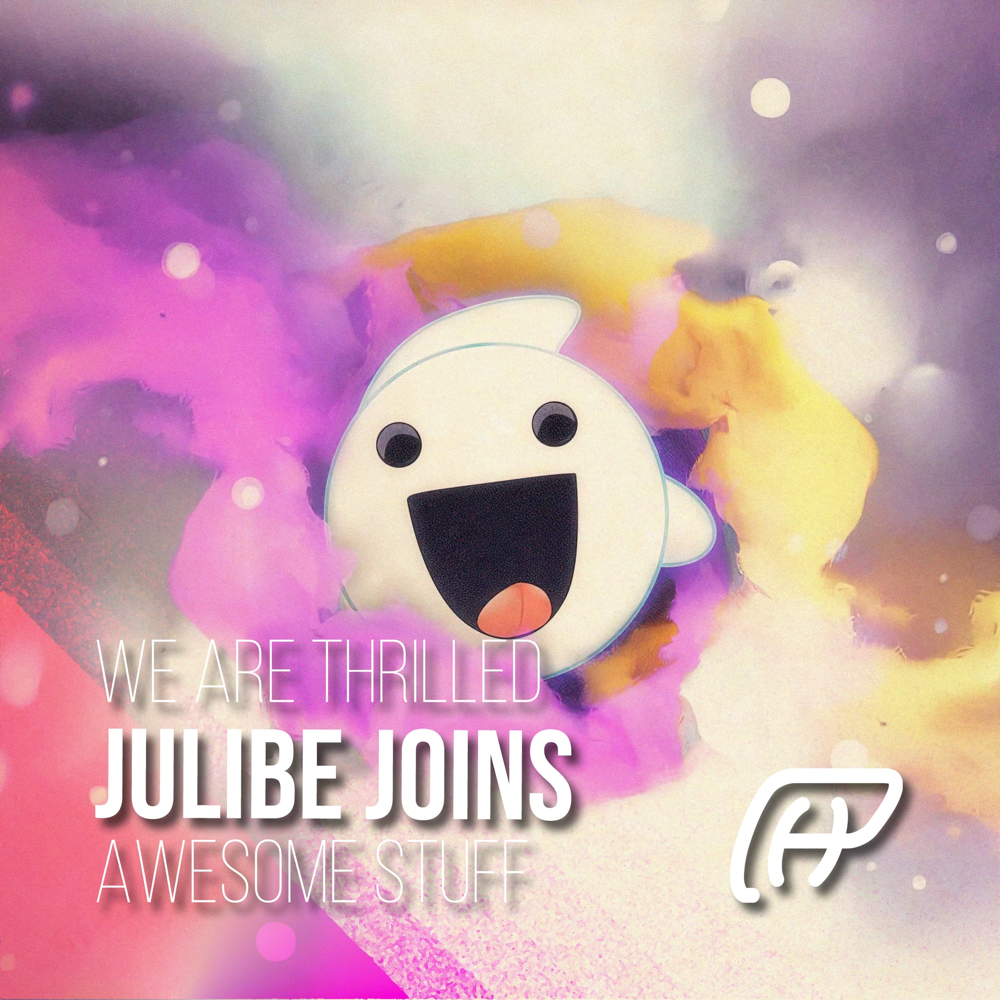

# Julibe Joins Phixel Family 👻
#### **We are excited to announce that Julibe (Julian Alberto De Salvador Castañeda, [https://julibe.com/](https://julibe.com/)), a talented Front-End designer and developer, has joined the Phixel Family! With a passion for designing and creating web applications, Julibe is sure to bring a fresh perspective and innovative ideas to our team.**

Julibe has a wealth of experience in the field, having worked on a variety of projects ranging from small business websites to large-scale e-commerce platforms. His attention to detail and dedication to delivering the best possible results for clients makes him a valuable asset to our team.

In addition to his technical skills, Julibe also brings a positive attitude and a desire to constantly learn and improve. We are confident that he will be a great fit with our company culture and are thrilled to have him on board.

## What about Phanto?

This cute ghost, also known as Phantolon Enikmatikus Luxiusto II, known for his friendly and approachable demeanor. Is now a valuable member of our team and brings a unique perspective and energy to our projects.

### We are thrilled to have Julibe, and Phanto, join the Phixel Family and are excited to see the contributions Julibe will make to our team. If you’re in need of a top-notch Front-End designer and developer, be sure to give Julibe a shout!
------------
## Exerpt
We are thrilled to have Julibe join the Phixel Family and are excited to see the contributions he will make to our team.
## Description
Julibe, a highly skilled Front-End designer and developer, has joined the Phixel Family. With a passion for web development and a strong track record, Julibe is sure to be a valuable addition to our team.
## Media
 
 
 
 

------------
- **Slug:** julibe
- **Date:** 04/01/2023
- **URL:** [https://phixel.net/en/julibe/](https://phixel.net/en/julibe/)
- **Short URL:** [https://bit.ly/3Ysg4vN](https://bit.ly/3Ysg4vN)
- **Type:** [Internal](#internal)
- **Hashtags:** #webdevelopment, #@julibe, #frontenddesign, #frontenddevelopment, #joins, #designer, #developer, #family, #team, #talent, #skills, #innovation, #technology, #julibe
- **Emojis:** 💻💡💪🏽🫥👻🫳🖤🎃😈👻🔮👅🌟🎉🎊🎓🔥🚀

------------
## Tags
[ ](# )
