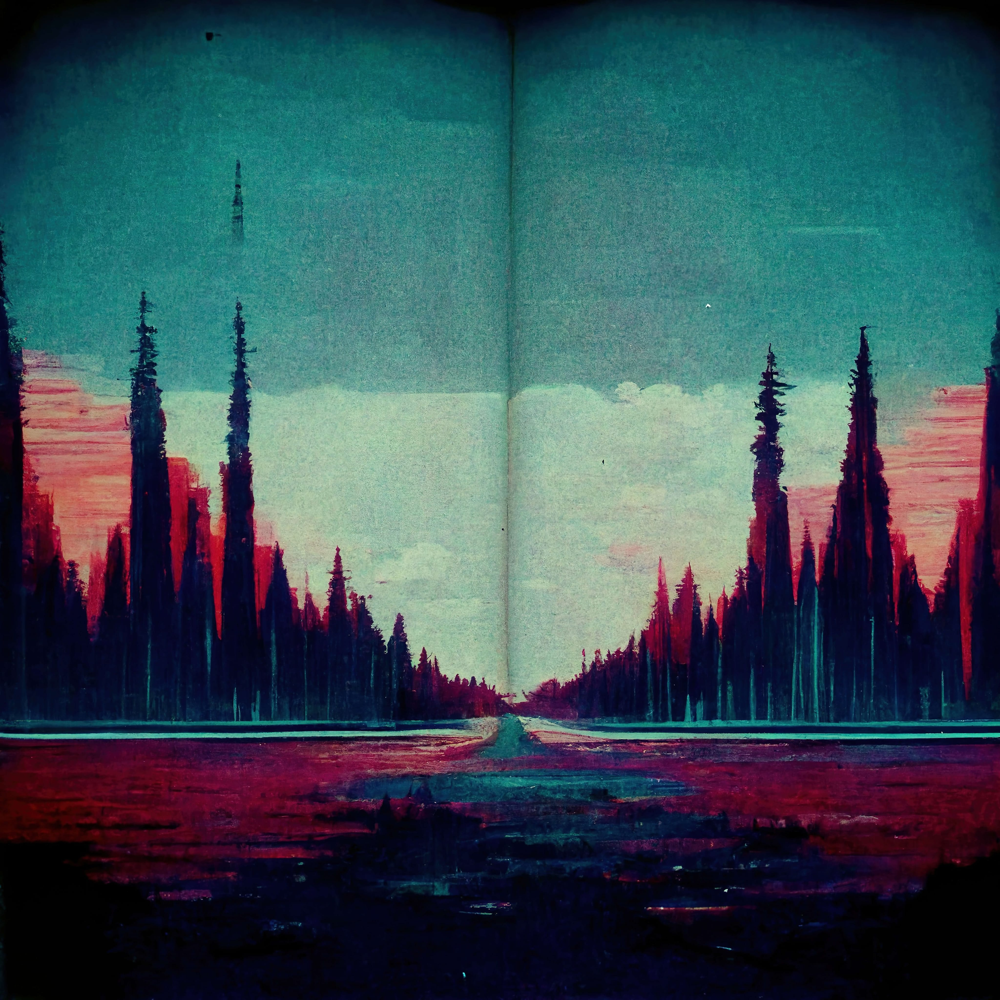

# 3D Animator 🛸
**Location:** Remote Work
**Job Type:** Freelancer

3D Animator responsibilities include, developing design and animation rigging protocols and ensuring the quality of the final product.

Ultimately, you will work with various departments and teams to help define, produce and publish video games, videos and interactive content for our organization.

## Job Responsibilities
- Prototyping animations and updating progress throughout development.
- Following industry trends and best practices.
- Supervision of workflows and animation.
- Development of design and animation tools.
- Perform quality control to ensure that the final product meets the organization’s standards.

- Generate ideas to increase customer and user engagement.
- Compliance with assigned work deadlines.
- Constructively receive comments from co-workers and clients.
- Understanding of the requirements of each project.
- Management of multiple projects.
- Understand the instructions, needs and specifications of the project, resources and equipment.
- Participate directly and actively in projects.
- Edit, correct and improve the existing content and products.
- Actively collect feedback from clients and users.

## Requirements and Skills
- Proven work experience as a 3D Animator or similar role.
- Portfolio of project examples.

- Creative mind and storytelling skills.
- Content presentation skills.
- Familiarity with web/app/video design.
- Teamwork and excellent communication skills.
- Enthusiasm and knowledge of the industry.
- Collaborate with the production team (designers, directors, etc.).
- Attention to detail skills.
- Time management skills.
- Adaptability.
- Analytical and multitasking skills.
- Comfortable working with deadlines and budget constraints. *
------------
## Exerpt
We are looking for an alluring 3D Animator
## Description
We are looking for a 3D Animator to join our team and assist us with designing and developing video games, interactive content and motion videos for our customers.
## Media

------------
- **Slug:** job-3d-animator
- **Date:** 18/10/2022
- **URL:** [https://phixel.net/en/jobs/3d-animator/](https://phixel.net/en/jobs/3d-animator/)
- **Type:** [Job](#job)
- **Hashtags:** #phixel, #webdesigners, #clients, #ui, #ux, #videoeditors, #webdevelopers, #animation, #webdesignstudio, #design, #workhard, #designer, #love, #gui, #illustration, #remotework, #studio, #motiongraphics, #workfromanywhere, #worksmart, #3d, #respet
- **Emojis:** 🎨🛸📼📺📹👍🔗📝🏠✍️👨‍💻⚙️🔮🎬‍💻👑🗃️🕹️👾🎮📲🪐🌟👽🚀🌌

------------
## Tags
[3D](#3d), [Animator](#animator), [Games](#games), [Video](#video), [Interactive](#interactive), [Content](#content), [Motion](#motion), [Design](#design), [Develop](#develop), [Quality](#quality), [Job](#job)
