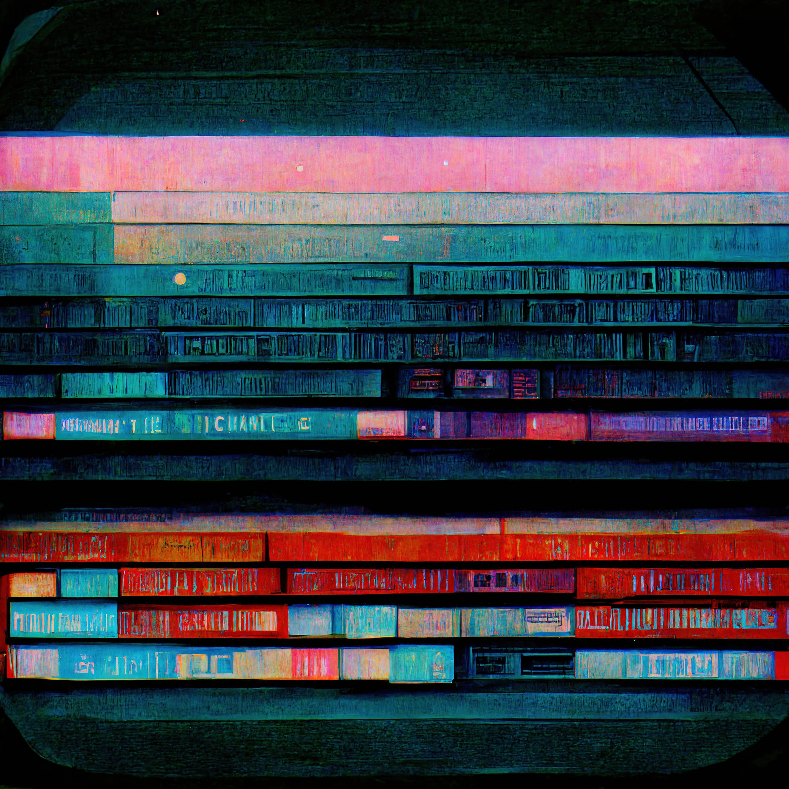

# Copywriter 📝
**Location:** Remote Work

**Job Type:** Freelancer

Your words will inform and engage the target audience.

You must be a team spirited, skilled and imaginative writer with an eye for detail.

If you can quickly understand the project requirements and offer valuable insights, we’d like to hear from you.

## Job Responsibilities
- Write clear, concise, attractive copy with a distinct voice.
- Interpret copywriting briefs to understand project requirements.
- Collaborate with designers, PR and other professionals on marketing projects.
- Conduct high-quality research and interviews.
- Edit and proofread copy as needed.
- Use SEO principles to maximize copy’s reach.
- Source images and other content.
- Generate ideas to increase customer and user engagement.
- Compliance with assigned work deadlines.
- Constructively receive comments from co-workers and clients.
- Understanding of the requirements of each project.
- Management of multiple projects.
- Understand the instructions, needs and specifications of the project, resources and equipment.
- Participate directly and actively in projects.
- Edit, correct and improve the existing content and products.
- Actively collect feedback from clients and users.

## Requirements and Skills
- Proven experience as a copywriter or related role.
- Knowledge of online content strategy and creation.
- Excellent writing, editing and proofreading skills.
- Experience with SEO.
- Strong research skills.
- Creativity.
- Collaborative spirit.
- Excellent time-management and organizational skills.

- Creative mind and storytelling skills.
- Content presentation skills.
- Familiarity with web/app/video design.
- Teamwork and excellent communication skills.
- Enthusiasm and knowledge of the industry.
- Collaborate with the production team (designers, directors, etc.).
- Attention to detail skills.
- Time management skills.
- Adaptability.
- Analytical and multitasking skills.
- Comfortable working with deadlines and budget constraints. *
------------
## Exerpt
We are looking for an elegant Copywriter
## Description
We are looking for a creative Copywriter to write clear and concise copy for ads, publications and websites. Your words will inform and engage target audiences.
## Media

------------
- **Slug:** job-copywriter
- **Date:** 18/10/2022
- **URL:** [https://phixel.net/en/jobs/copywriter/](https://phixel.net/en/jobs/copywriter/)
- **Type:** [Job](#job)
- **Hashtags:** #phixel #webdesigners #clients #ui #ux #videoeditors #webdevelopers #animation #webdesignstudio #design #workhard #designer #phixel #love #gui #animation #illustration #remotework #studio #motiongraphics #workfromanywhere #worksmart #3d #respet
- **Emojis:** 🎨 🛸 📼 📺 📹 👍 🔗 📝 🏠 ✍️ 👨 💻 👑 🗃 👾 🎮 📲 🪐 🌟 👽 🚀 🌌

------------
## Tags
[Copywriter](#Copywriter), [Writing](#Writing), [Clear](#Clear), [Concise](#Concise), [Attractive](#Attractive), [Voice](#Voice), [Research](#Research), [SEO](#SEO), [Online](#Online), [Content](#Content), [Job](#Job)
