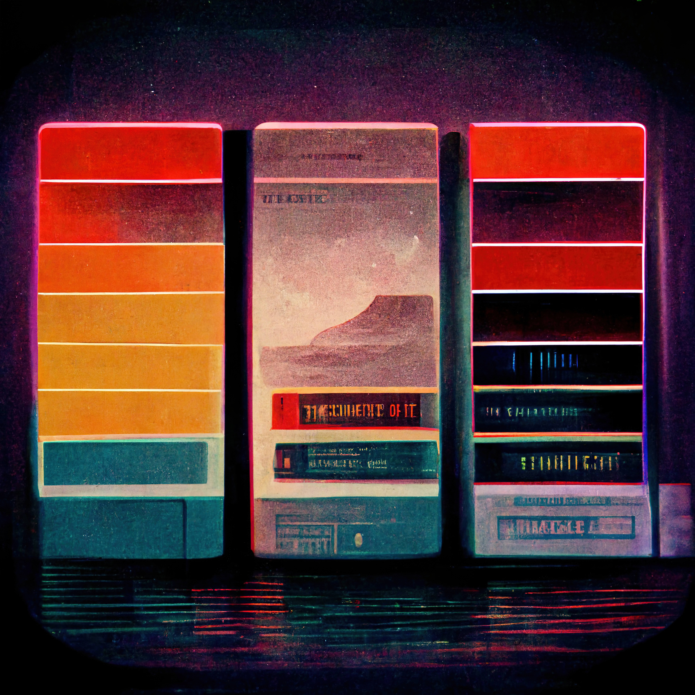

# Graphic Designer ✍️
**Location:** Remote Work
**Job Type:** Freelancer

As a graphic designer you will need to include the entire process of defining requirements, visualizing and creating graphics, including illustrations, logos, layouts and photography.

who will shape the visual aspects of websites, mobile applications and more.

Your graphics must capture the attention of those who see them and communicate the right message.

For this, you must have a creative flair and a strong ability to meet design requirements.

If you can communicate well and work methodically as part of a team, we’d like to meet you.

The goal is to inspire and engage the target audience.

## Job Responsibilities

- Study design briefs and determine requirements.
- Schedule projects and define budget constraints.
- Conceptualize visual elements based on requirements.
- Prepare drafts and present ideas.
- Develop illustrations, logos, and other designs using desisoftware.e.
- Use the appropriate colors and designs for each graph.
- Work with copywriters and creative director to produce the final design.
- Test the graphics on various media.
- Modify designs after feedback.
- Ensuring that the final graphics and designs are visually appealing and live up to the brand.
- Generate ideas to increase customer and user engagement.
- Compliance with assigned work deadlines.
- Constructively receive comments from co-workers and clients.
- Understanding of the requirements of each project.
- Management of multiple projects.
- Understand the instructions, needs and specifications of the project, resources and equipment.
- Participate directly and actively in projects.
- Edit, correct and improve the existing content and products.
- Actively collect feedback from clients and users.

## Requirements and Skills
- Proven graphic designing experience.
- A strong portfolio of illustrations or other graphics.
- Familiarity with design software and technologies (such as InDesign, Illustrator, Dreamweaver, Photoshop).
- A keen eye for aesthetics and details.
- Excellent communication skills.
- Ability to work methodically and meet deadlines.
- Degree in Design, Fine Arts or related field is a plus.
- Creative mind and storytelling skills.
- Content presentation skills.
- Familiarity with web/app/video design.
- Teamwork and excellent communication skills.
- Enthusiasm and knowledge of the industry.
- Collaborate with the production team (designers, directors, etc.).
- Attention to detail skills.
- Time management skills.
- Adaptability.
- Analytical and multitasking skills.
- Comfortable working with deadlines and budget constraints. *

------------
## Exerpt
We are looking for an spotless Graphic Designer
## Description
We are seeking a Graphic Designer to create engaging, branded graphics for a variety of media.
## Media

------------
- **ID:** 3XDL
- **Date:** 1666044000
- **URL:** [https://phixel.net/en/jobs/graphic-designer/](https://phixel.net/en/jobs/graphic-designer/)
- **Type:** [Job](#job)
- **Emojis:** 🎨 🛸 📼 📺 📹 👍 🔗 📝 🏠 ✍️ 👨 💻 👑 🗃 👾 🎮 📲 🪐 🌟 👽 🚀 🌌

------------
## Tags
[phixel](#phixel), [webdesigners](#webdesigners), [clients](#clients), [ui](#ui), [ux](#ux), [videoeditors](#videoeditors), [webdevelopers](#webdevelopers), [animation](#animation), [webdesignstudio](#webdesignstudio), [design](#design), [workhard](#workhard), [designer](#designer), [phixel](#phixel), [love](#love), [gui](#gui), [animation](#animation), [illustration](#illustration), [remotework](#remotework), [studio](#studio), [motiongraphics](#motiongraphics), [workfromanywhere](#workfromanywhere), [worksmart](#worksmart), [3d](#3d), [respet](#respet)
