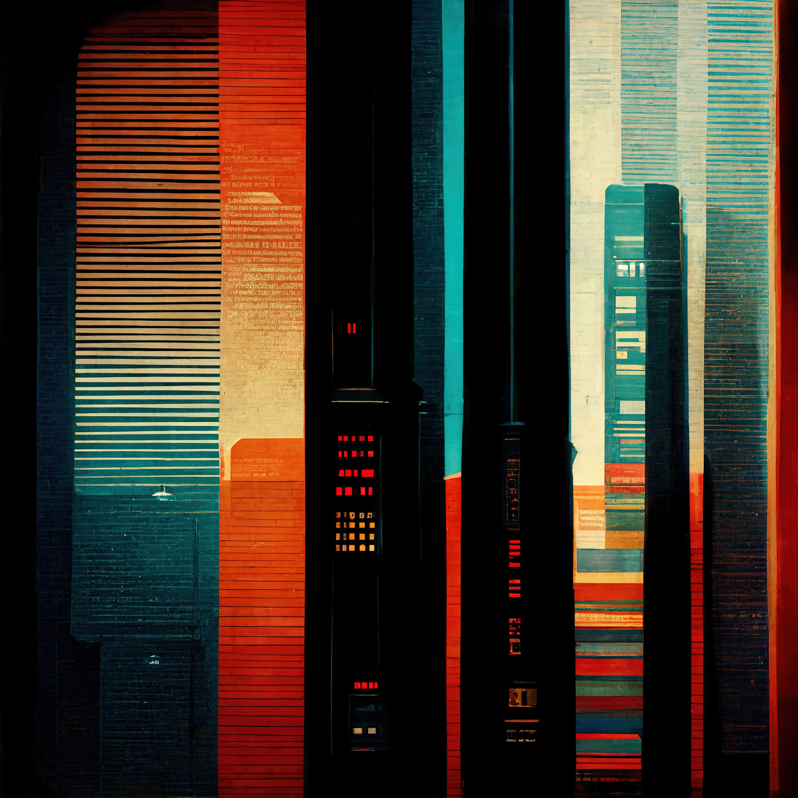

# Illustrator 🎨
**Location:** Remote Work
**Job Type:** Freelancer

You’ll need to collaborate with clients, publishers, and marketers to make sure your jaw drops and outlines their business needs to engage their audience.

You will use your creative skills to turn messages and ideas into attractive illustrations, 

Ultimately, you’ll create artwork that meets quality standards on time.
## Job Responsibilities
- Prepare drafts according to requirements.
- Combine hand drawing and painting with digital media to create complete illustrations.
- Define designs with illustration software.
- Use various colors, graphics and effects to better visualize each concept.
- Apply isometric techniques to add perspective to complex shapes.
- Participate in design briefs with clients, publishers, and/or marketers to identify their needs.
- Define time and budget constraints.
- Make sure printed artwork meets quality and color standards.
- Brainstorm with the design team to generate new ideas, patterns, and styles.
- Keep up to date with new design techniques and software.

- Generate ideas to increase customer and user engagement.
- Compliance with assigned work deadlines.
- Constructively receive comments from co-workers and clients.
- Understanding of the requirements of each project.
- Management of multiple projects.
- Understand the instructions, needs and specifications of the project, resources and equipment.
- Participate directly and actively in projects.
- Edit, correct and improve the existing content and products.
- Actively collect feedback from clients and users.

## Requirements and Skills
- Proven work experience as an illustrator, graphic designer or similar.
- Demonstrable portfolio of complete illustrations.
- Hands-on experience with computer aided design software.
- Strong knowledge of image editing and digital drawing software, such as Photoshop, InDesign, and Adobe Illustrator.
- Drawing skills with attention to detail.
- Strong aesthetic and conceptual skills.
- Creative mind and storytelling skills.
- Content presentation skills.
- Familiarity with web/app/video design.
- Teamwork and excellent communication skills.
- Enthusiasm and knowledge of the industry.
- Collaborate with the production team (designers, directors, etc.).
- Attention to detail skills.
- Time management skills.
- Adaptability.
- Analytical and multitasking skills.
- Comfortable working with deadlines and budget constraints. *
------------
## Exerpt
We are looking for an breathtaking Illustrator
## Description
We are looking for a talented Illustrator to create original artwork for digital publications.
## Media
 

------------
- **Slug:** job-illustrator
- **Date:** 18/10/2022
- **URL:** [https://phixel.net/en/jobs/illustrator/](https://phixel.net/en/jobs/illustrator/)
- **Short URL:** [https://bit.ly/3JiJBUg](https://bit.ly/3JiJBUg)
- **Type:** [Job](#job)
- **Hashtags:** #webdesigners, #clients, #ui, #ux, #videoeditors, #webdevelopers, #animation, #webdesignstudio, #design, #workhard, #designer, #love, #gui, #illustration, #remotework, #studio, #motiongraphics, #workfromanywhere, #worksmart, #3d, #respet
- **Emojis:** 🎨🛸📼📺📹👍🔗📝🏠✍️👨‍💻⚙️🔮🎬‍💻👑🗃️🕹️👾🎮📲🪐🌟👽🚀🌌

------------
## Tags
[3D](#3d), [Modeler](#modeler), [Animator](#animator), [Graphic Designer](#graphic-designer), [Illustrator](#illustrator), [Copywriter](#copywriter), [Dr. Darkness](#dr.-darkness), [Phixel](#phixel), [Design](#design), [Creativity](#creativity), [Art](#art), [Job](#job)
