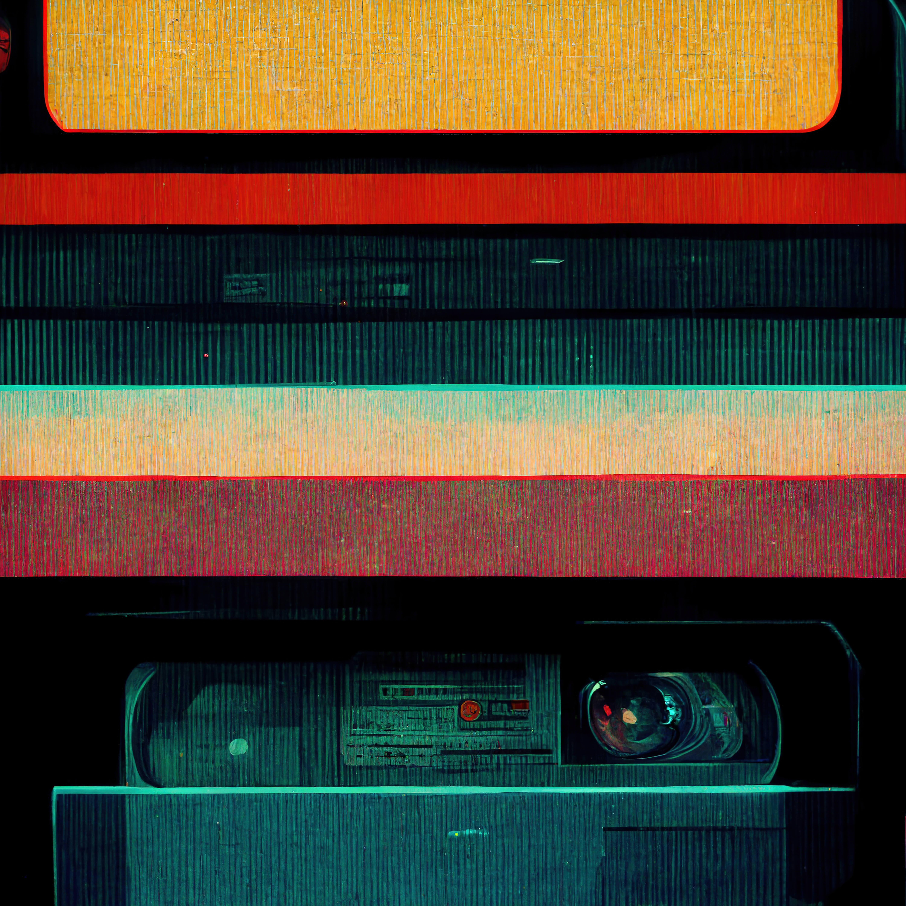

# Motion Grapher 🤸‍♀️
**Location:** Remote Work
**Job Type:** Freelancer

Your work will give life to storylines and characters in films, games or videos.

You should possess a creative eye and artistic aptitude and easily turn a script or a concept into an impressive computer-generated animation. To excel in this role, you must be highly skilled in CGI software and storytelling.

## Job Responsibilities 
- Read scripts and stories to understand animation requirements.
- Prepare presentations with rough designs for clients.
- Develop storyboards for the initial stages of production.
- Create models, drawings and illustrations by hand or digitally.
- Stitch images with background graphics and special effects (Vfx).
- Ensure synchronization of frames and audio.
- Participate in the editing process.
- Direct the work of animation assistants.
- Generate ideas to increase customer and user engagement.
- Compliance with assigned work deadlines.
- Constructively receive comments from co-workers and clients.
- Understanding of the requirements of each project.
- Management of multiple projects.
- Understand the instructions, needs and specifications of the project, resources and equipment.
- Participate directly and actively in projects.
- Edit, correct and improve the existing content and products.
- Actively collect feedback from clients and users.

## Requirements and Skills
- Proven experience as a Motion Grapher.
- Knowledge of 2D/3D, stop motion and digital animation.
- Experience in project management.
- Proficient in CGI software (Photoshop, Blender, After Effects, etc.).
- Creative mind and storytelling skills.
- Content presentation skills.
- Familiarity with web/app/video design.
- Teamwork and excellent communication skills.
- Enthusiasm and knowledge of the industry.
- Collaborate with the production team (designers, directors, etc.).
- Attention to detail skills.
- Time management skills.
- Adaptability.
- Analytical and multitasking skills.
- Comfortable working with deadlines and budget constraints. *

------------
## Exerpt
We are looking for an striking Motion Grapher
## Description
We are looking for a creative Motion Grapher to develop excellent visual frames with 2D/3D or other techniques.
## Media

------------
- **ID:** AU24
- **Date:** 18/10/2022
- **URL:** [https://phixel.net/en/jobs/motion-grapher/](https://phixel.net/en/jobs/motion-grapher/)
- **Type:** [Job](#job)
- **Emojis:** 🎨 🛸 📼 📺 📹 👍 🔗 📝 🏠 ✍️ 👨 💻 👑 🗃 👾 🎮 📲 🪐 🌟 👽 🚀 🌌

------------
## Tags
[phixel](#phixel), [webdesigners](#webdesigners), [clients](#clients), [ui](#ui), [ux](#ux), [videoeditors](#videoeditors), [webdevelopers](#webdevelopers), [animation](#animation), [webdesignstudio](#webdesignstudio), [design](#design), [workhard](#workhard), [designer](#designer), [phixel](#phixel), [love](#love), [gui](#gui), [animation](#animation), [illustration](#illustration), [remotework](#remotework), [studio](#studio), [motiongraphics](#motiongraphics), [workfromanywhere](#workfromanywhere), [worksmart](#worksmart), [3d](#3d), [respet](#respet)
