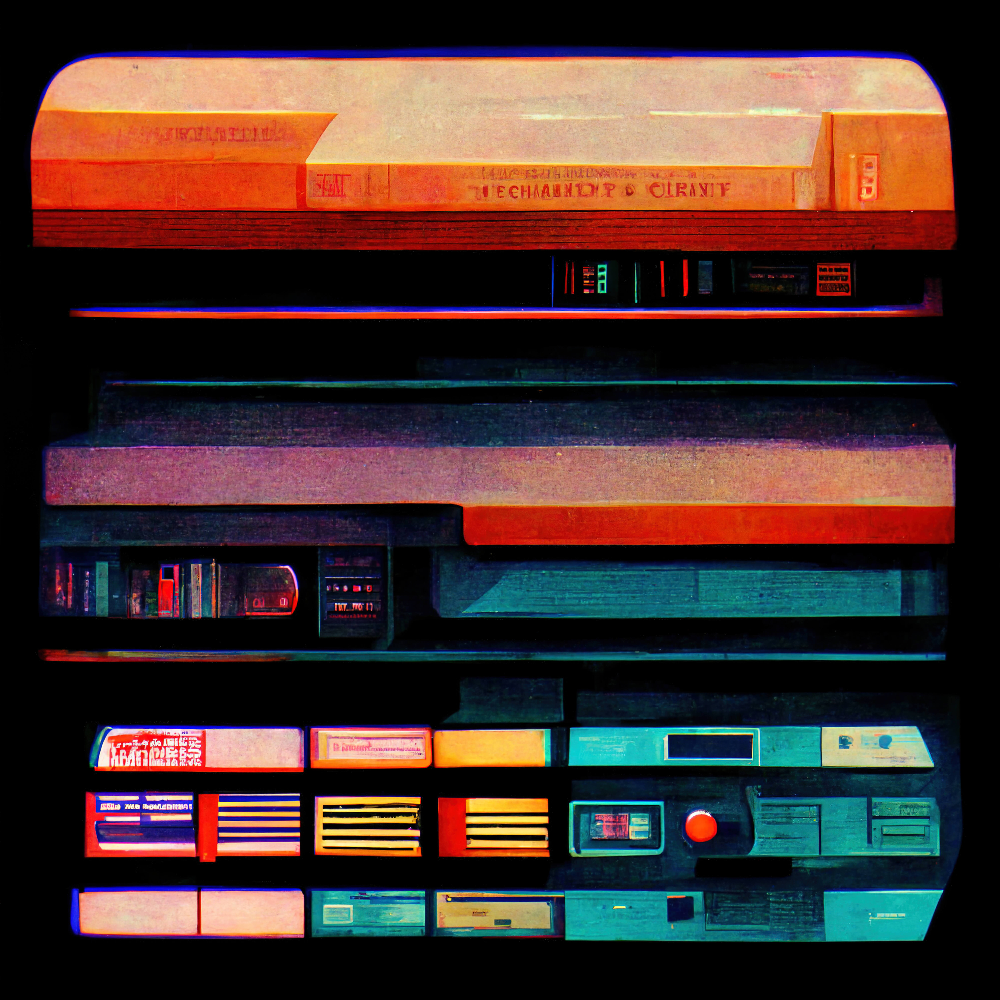

# UI Designer 📲
**Location:** Remote Work
**Job Type:** Freelancer

The ideal candidate should have an eye for clean and artful design, possess superior UI skills and be able to translate high-level requirements into interaction flows and artifacts, and transform them into beautiful, intuitive, and functional user interfaces.

## Job Responsibilities

- Collaborate with product management and engineering to define and implement innovative solutions for the product direction, visuals and experience.
- Execute all visual design stages from concept to final hand-off to engineering.
- Conceptualize original ideas that bring simplicity and user friendliness to complex design roadblocks.
- Create wireframes, storyboards, user flows, process flows and site maps to effectively communicate interaction and design ideas.
- Present and defend designs and key milestone deliverables to peers and executive level stakeholders.
- Conduct user research and evaluate user feedback.
- Establish and promote design guidelines, best practices and standards.
- Generate ideas to increase customer and user engagement.
- Compliance with assigned work deadlines.
- Constructively receive comments from co-workers and clients.
- Understanding of the requirements of each project.
- Management of multiple projects.
- Understand the instructions, needs and specifications of the project, resources and equipment.
- Participate directly and actively in projects.
- Edit, correct and improve the existing content and products.
- Actively collect feedback from clients and users.

## Requirements and Skills
- Proven UI design experience.
- Demonstrable UI design skills with a strong portfolio.
- Solid experience in creating wireframes, storyboards, user flows, process flows and site maps.
- Proficiency in Photoshop, Illustrator, or other visual design and wire-framing tools.
- Proficiency in HTML, CSS, and JavaScript for rapid prototyping.
- Excellent visual design skills with sensitivity to user-system interaction.
- Ability to present designs and sell your solutions to various stakeholders.
- Ability to solve problems creatively and effectively.
- Up-to-date with the latest UI trends, techniques, and technologies.
- Experience in Human-Computer Interaction, Interaction Design, or related.
- Creative mind and storytelling skills.
- Content presentation skills.
- Familiarity with web/app/video design.
- Teamwork and excellent communication skills.
- Enthusiasm and knowledge of the industry.
- Collaborate with the production team (designers, directors, etc.).
- Attention to detail skills.
- Time management skills.
- Adaptability.
- Analytical and multitasking skills.
- Comfortable working with deadlines and budget constraints. *

------------
## Exerpt
We are looking for an immaculate UI Designer
## Description
We are looking for a talented UI Designer to create amazing user experiences.
## Media

------------
- **ID:** Q1MY
- **Date:** 1666044000
- **URL:** [https://phixel.net/en/jobs/ui-designer/](https://phixel.net/en/jobs/ui-designer/)
- **Type:** [Job](#job)
- **Emojis:** 🎨 🛸 📼 📺 📹 👍 🔗 📝 🏠 ✍️ 👨 💻 👑 🗃 👾 🎮 📲 🪐 🌟 👽 🚀 🌌

------------
## Tags
[phixel](#phixel), [webdesigners](#webdesigners), [clients](#clients), [ui](#ui), [ux](#ux), [videoeditors](#videoeditors), [webdevelopers](#webdevelopers), [animation](#animation), [webdesignstudio](#webdesignstudio), [design](#design), [workhard](#workhard), [designer](#designer), [phixel](#phixel), [love](#love), [gui](#gui), [animation](#animation), [illustration](#illustration), [remotework](#remotework), [studio](#studio), [motiongraphics](#motiongraphics), [workfromanywhere](#workfromanywhere), [worksmart](#worksmart), [3d](#3d), [respet](#respet)
