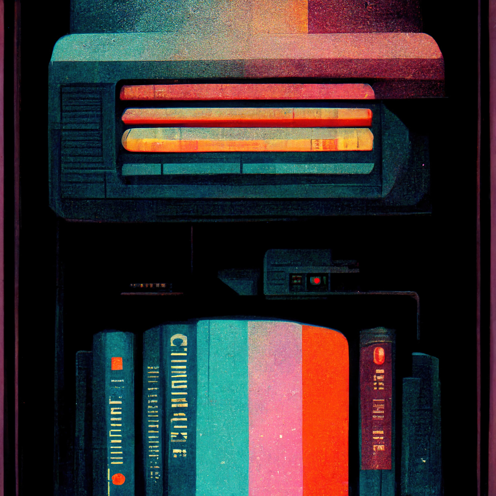

# Web Designer 🔮
**Location:** Remote Work
**Job Type:** Freelancer

You must have an eye for clean and slick web design.

You must also have superior user interface design skills.

You have to be able to transform high-level requirements in flows and interaction artifacts into beautiful, interactive, intuitive and functional designs.

## Job Responsibilities

- Execute all stages of visual design from concept to final delivery to engineering.
- Conceptualize original website design ideas that bring simplicity and ease of use to complex obstacles.
- Create wireframes, storyboards, user flows, process flows, and sitemaps to communicate design and interaction ideas.
- Present and support designs and deliverables to peers and executive-level stakeholders.
- Establish and promote design guidelines, best practices and standards.
- Generate ideas to increase customer and user engagement.
- Compliance with assigned work deadlines.
- Constructively receive comments from co-workers and clients.
- Understanding of the requirements of each project.
- Management of multiple projects.
- Understand the instructions, needs and specifications of the project, resources and equipment.
- Participate directly and actively in projects.
- Edit, correct and improve the existing content and products.
- Actively collect feedback from clients and users.

## Requirements and Skills
- Proven work experience as a Web Designer.
- Demonstrable graphic design skills with a strong portfolio.
- Solid experience creating wireframes, storyboards, user flows, process flows, and sitemaps.
- Proficiency in Photoshop, Illustrator or other visual design and wireframe tools.
- Fluency in HTML, CSS, and JavaScript for rapid prototyping.
- Excellent visual design skills with sensitivity to user-system interaction.
- Ability to solve problems creatively and effectively.
- Keep up to date with the latest trends, techniques and Web technologies.
- Creative mind and storytelling skills.
- Content presentation skills.
- Familiarity with web/app/video design.
- Teamwork and excellent communication skills.
- Enthusiasm and knowledge of the industry.
- Collaborate with the production team (designers, directors, etc.).
- Attention to detail skills.
- Time management skills.
- Adaptability.
- Analytical and multitasking skills.
- Comfortable working with deadlines and budget constraints. *
------------
## Exerpt
We are looking for an spectacular Web Designer
## Description
We are looking for a talented Web Designer to create amazing user experiences.
## Media
 

------------
- **Slug:** job-web-designer
- **Date:** 18/10/2022
- **URL:** [https://phixel.net/en/jobs/web-designer/](https://phixel.net/en/jobs/web-designer/)
- **Short URL:** [https://bit.ly/3YvNSI9](https://bit.ly/3YvNSI9)
- **Type:** [Job](#job)
- **Hashtags:** #webdesigners, #clients, #ui, #ux, #videoeditors, #webdevelopers, #animation, #webdesignstudio, #design, #workhard, #designer, #love, #gui, #illustration, #remotework, #studio, #motiongraphics, #workfromanywhere, #worksmart, #3d, #respet
- **Emojis:** 🎨🛸📼📺📹👍🔗📝🏠✍️👨‍💻⚙️🔮🎬‍💻👑🗃️🕹️👾🎮📲🪐🌟👽🚀🌌

------------
## Tags
[Web Design](#web-design), [UI Design](#ui-design), [User Experience](#user-experience), [Graphic Design](#graphic-design), [Wireframing](#wireframing), [HTML](#html), [CSS](#css), [JavaScript](#javascript), [Rapid Prototyping](#rapid-prototyping), [Web Technologies](#web-technologies), [Job](#job)
