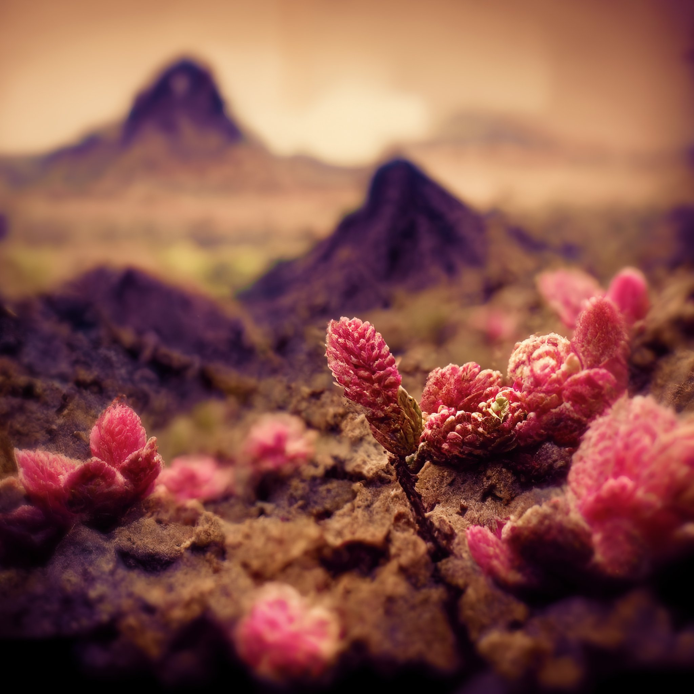

# Blog 🚀
In our blog, we are constantly inspired by the retro sci-fi genre and all of the amazing stories and ideas it has to offer. As we sit under the neon light, gazing at the snowy pink mountain outside, we can't help but feel inspired to write and share our thoughts on this exciting genre. Join us as we explore the world of retro sci-fi and all of its possibilities.

------------
## Exerpt
Can't help but feel inspired by retro sci-fi
## Description
Under the neon light we contemplate the snowy pink mountain and write in this blog.
## Media

------------
- **ID:** MJOI
- **Date:** 1262300400
- **URL:** [https://phixel.net/en/blog/](#https://phixel.net/en/blog/)
- **Type:** [Page](#Page)
- **Emojis:** 📢 📃 🔌 🦄 ✏️ 🧪 😎 📄 🐲 👓 🦉 👽 🎮 📼 🪄 🤖 🐇 📫 🪐 👨 📽 🦼 🐈 🏕 🧜 🏿 ⚗️ 📷 🏞 ♀️ 👺 🔥 ☂️ ☢️ 👍 🦾
------------
## Tags
[mountain](#mountain), [blog](#blog), [retrofuture](#retrofuture), [videography](#videography), [animation](#animation), [retrofuturism](#retrofuturism), [sci-fi](#sci-fi), [phixel](#phixel), [video](#video), [writer](#writer), [sciencefiction](#sciencefiction), [writing](#writing), [blogging](#blogging), [writerstyle](#writerstyle), [canthelpbutfeelinspired](#canthelpbutfeelinspired), [retro](#retro), [retrofutureart](#retrofutureart), [retrofuturistic](#retrofuturistic)