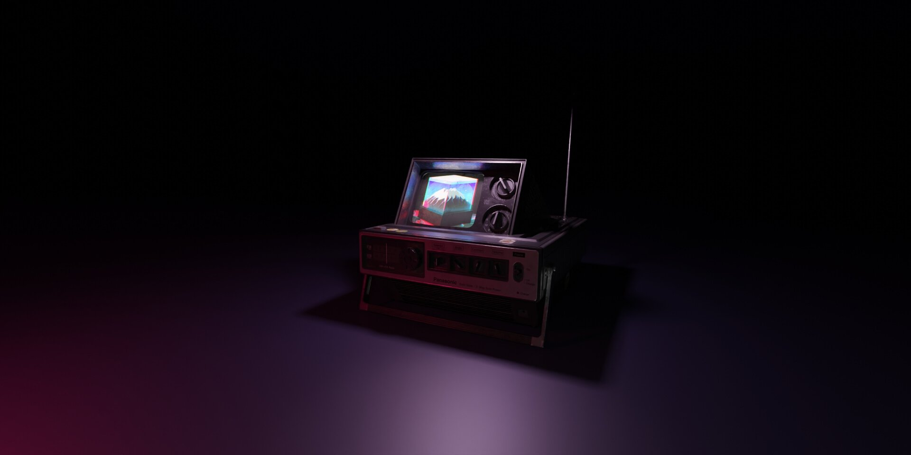

# Imposible!, an Error 404 ⚠️
On the border of Reality under the neon light we encounter an error, something surreal, something otherworldly. We feel so uneasy.

## But we remember...

We walk through the door into this world not knowing that there is much more to discover, and that is what makes it so exciting…
We can always go back and fix our mistakes

## Or

We can without exception find a new path
------------
## Exerpt
We can always go back and fix our mistakes OR we can without exception find a new path
## Description
An unsettling experience on the border of reality, illuminated by neon lights and encountering something surreal and otherworldly. However, this discomfort can be overcome by remembering that there is much to discover and explore in the world.
Highlighting the importance of adaptability and growth, encouraging individuals to either fix their mistakes or find a new path.
## Media
 

------------
- **Slug:** error
- **Date:** 01/01/2020
- **URL:** [https://phixel.net/error](https://phixel.net/error)
- **Short URL:** [false](false)
- **Type:** [Page](#page)
- **Hashtags:** #reality, #surreal, #discover, #excitement, #mistakes, #newpath, #growth, #adaptability, #decisionmaking, #error, #404
- **Emojis:** 🤷🏾⚠️❌🚨⛔📢⚠❗🛑😖🆘🤕💔🥹📛😕🚧🤷🏾

------------
## Tags
[Error](#error), [Philosophy](#philosophy), [Fiction](#fiction), [Surrealism](#surrealism), [Self-improvement](#self-improvement), [Personal Growth](#personal-growth), [Decision-making](#decision-making), [404](#404)
