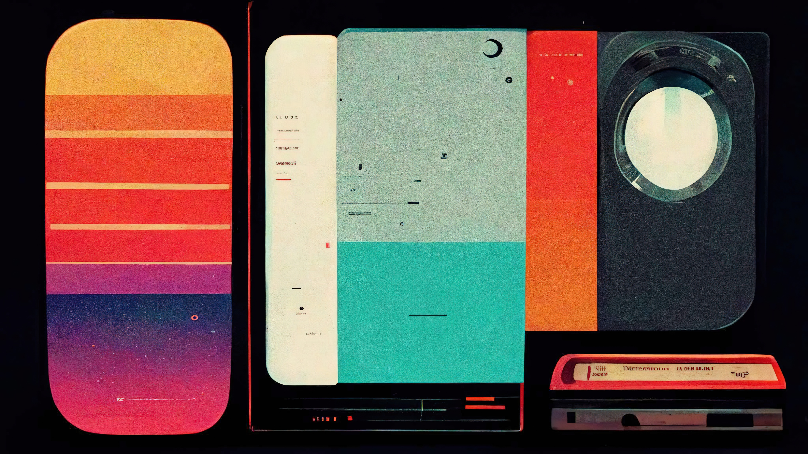

# Services 🔧
### What We Do 
 
## Services 
 
### From product design and development to website design, we have a service to fit your needs. 
 
We offer a wide range of services to meet your needs. Whether you need a new website created, or you need to help your online visibility, we can help. 
 
 
## Our approach to design is simple 
 
### Immersive. 
 
We are convinced that outstanding design and development should provide unique, experiential learning opportunities that provide a gateway into the hearts and minds of people. 
 
 
### Balanced. 
 
Our team of designers and developers strive to create products that are not only visually appealing, but also highly functional. 
 
### Accessible. 
 
We believe that stunning design and development should be accessible to everyone, and we work hard to make sure our products are affordable without sacrificing quality. 
 
### Timeless. 
 
We strive to create designs that are both beautiful and practical, and that will stand the test of time. 
 
#### We also offer a variety of other services, such as logo design, branding, and social media marketing. Contact us today to learn more about our services or to get started on your project! 
 
A ground-up approach, we’ll work with you every step of the way to make sure you get the results you’re looking for. 
 
A focused, strategic approach, we’ll work with you to help you design what’s important to success. 
 
A systematic, proactive, and reactive approach, we’ll work with you ensuring your projects are successful, organized and on track.

------------
## Exerpt
Stunning services designed for your needs
## Description
At Phixel, we offer a wide range of services to help you get the most out of your business.
## Media

------------
- **ID:** 1B5V
- **Date:** 1579474800
- **URL:** [https://phixel.net/en/about-us/services/](https://phixel.net/en/about-us/services/)
- **Type:** [Page](#page)
- **Emojis:** 🆒 📀 🕶 💻 🖼 ️✏ ️⭐ 🦿 🖋 🎞 🏆 🦾 📹 🥽 📸 🎩 🧑 📏 🧰 🎶 🤩 🖱 ♂️ 💚 📷 💡 🖌 🦲 🎬 ✒️

------------
## Tags
[phixel](#phixel), [withlove](#withlove), [build](#build), [ui](#ui), [mobile](#mobile), [web](#web), [accessible](#accessible), [creative](#creative), [ux](#ux), [grow](#grow), [virtual](#virtual), [augmented](#augmented), [variety](#variety), [successful](#successful), [design](#design), [offer](#offer), [proactive](#proactive), [support](#support), [webdesign](#webdesign), [organized](#organized), [yourneeds](#yourneeds), [design](#design), [animation](#animation), [branding](#branding), [stunning](#stunning), [motiongraphic](#motiongraphic), [logo](#logo), [balanced](#balanced), [expertsnonexperts](#expertsnonexperts), [vr](#vr), [marketing](#marketing), [gui](#gui), [webapp](#webapp), [timeless](#timeless), [simpleapproach](#simpleapproach), [immersive](#immersive), [services](#services), [reality](#reality)
