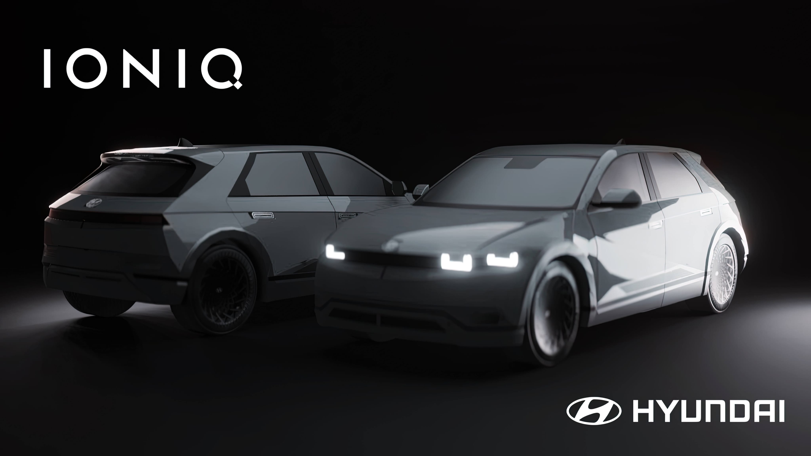

# IONIQ 5 🚙
Client: Hyundai
Year: 2022
Role: Case study, Landing page, Interactive 3D

In this case study, you’ll learn more about the design process that went into creating the landing page for the IONIQ 5. Hyundai’s newest electric SUV on the market and it’s quickly earning a reputation as one of the best.

With its sleek, stylish design and top-of-the-line features, the IONIQ 5 is perfect for consumers who are looking for a vehicle that’s both environmentally friendly and high-performing.
------------
## Exerpt
Electric SUV (Case study)
## Description
In this case study, you'll learn more about the design process that went into creating the landing page for the IONIQ 5.
## Media
 
 
	<a href="media/bd491a79/hyundai-ioniq-5-desktop-mobile-1.mp4" target="_media">mp4: hyundai-ioniq-5-desktop-mobile-1.mp4</a> 
 
 
 
 
 
 
	<a href="media/8706258d/hyundai-ioniq-5.glb" target="_media">glb: hyundai-ioniq-5.glb</a> 

------------
- **Slug:** hyundai-ioniq
- **Date:** 18/11/2022
- **URL:** [https://phixel.net/en/portfolio/ioniq/](https://phixel.net/en/portfolio/ioniq/)
- **Type:** [Portfolio](#portfolio)
- **Hashtags:** #phixel, #casestudy, #portfolio, #hyundai, #IONIQ5, #ioniq, #landingpage, #electric, #suv, #car, #electricvehicle
- **Emojis:** 🆒🚙🔋⚡🌱

------------
## Tags
[ ](# )
