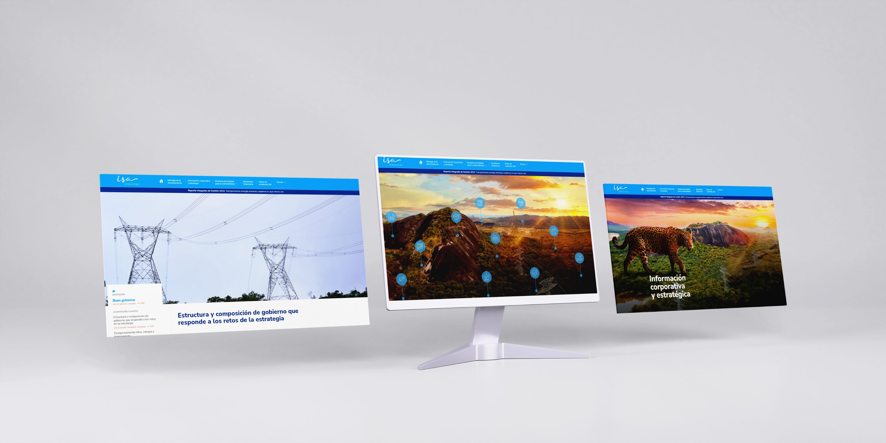

# ISA InterColombia - Management Report 2022
The ISA InterColombia 2022 Report showcases the excellent results of the year and the company’s commitment to generating value in territories, promoting energy transition, and sustainable growth of society and its territories.

The report covers corporate and strategic information, comprehensive risk management, government structure and composition, procurement model, new energy businesses, management of relevant issues, digital transformation, ISA and its companies’ profiles, key figures, challenges for 2023, integrated reputation and sustainability model with its 9 dimensions and 28 issues, as well as the main financial figures of the company in 2022.

The GRI contents, financial results, and annexes are also included. The report emphasizes the established relationships of trust with stakeholders and the adequate management of the environmental, social, and service environment.
------------
## Exerpt
Discover ISA InterColombia's 2022 achievements in promoting sustainable growth & energy transition.

https://informesempresariales.isaintercolombia.com/2022/
## Description
The ISA InterColombia 2022 Integrated Report highlights the company's excellent performance and dedication to generating value in territories, propelling the energy transition, and promoting sustainable growth for society and its regions.
## Media
 
	<a href="media/f2d31c63/isa-informe-de-gestion-2022.mp4" target="_media">mp4: isa-informe-de-gestion-2022.mp4</a> 
 
 
 
 
 
 
 
 

------------
- **Slug:** isa-2022
- **Date:** 01/04/2023
- **URL:** [https://phixel.net/en/portfolio/isa-2022/](https://phixel.net/en/portfolio/isa-2022/)
- **Short URL:** [https://bit.ly/3GUigWT](https://bit.ly/3GUigWT)
- **Type:** [Portfolio](#portfolio)
- **Hashtags:** #ISAInterColombia, #EnergyTransition, #SustainableGrowth, #IntegratedReport, #Governance, #RiskManagement, #Innovation, #DigitalTransformation, #Environment, #SocialImpact
- **Emojis:** 🌍💡♻️📊🔋🌱🤝💼🚀🔌

------------
## Tags
[Energy](#energy), [Sustainability](#sustainability), [Governance](#governance), [Risk](#risk), [Finance](#finance), [Transition](#transition), [Strategy](#strategy), [Innovation](#innovation), [Digital](#digital), [Environment](#environment)
