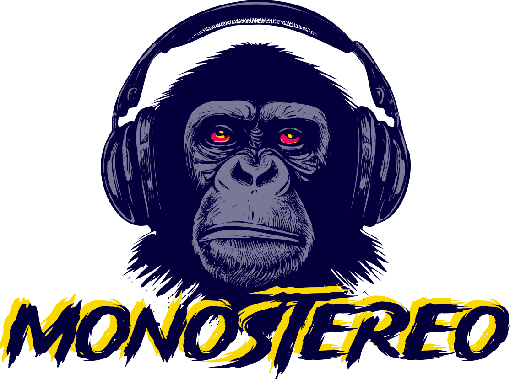
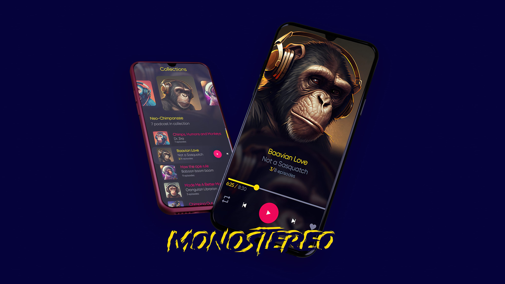
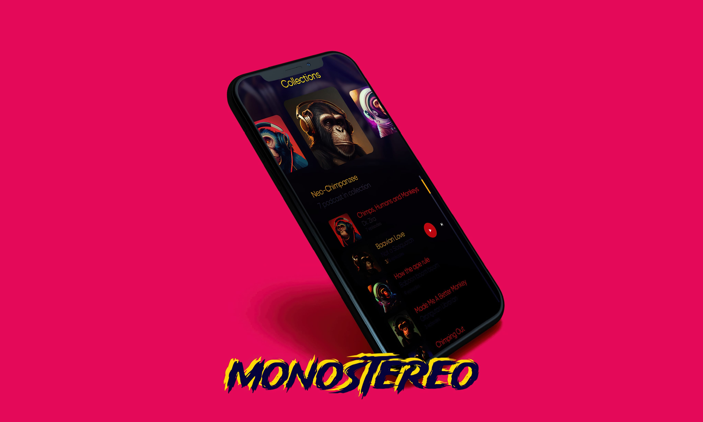
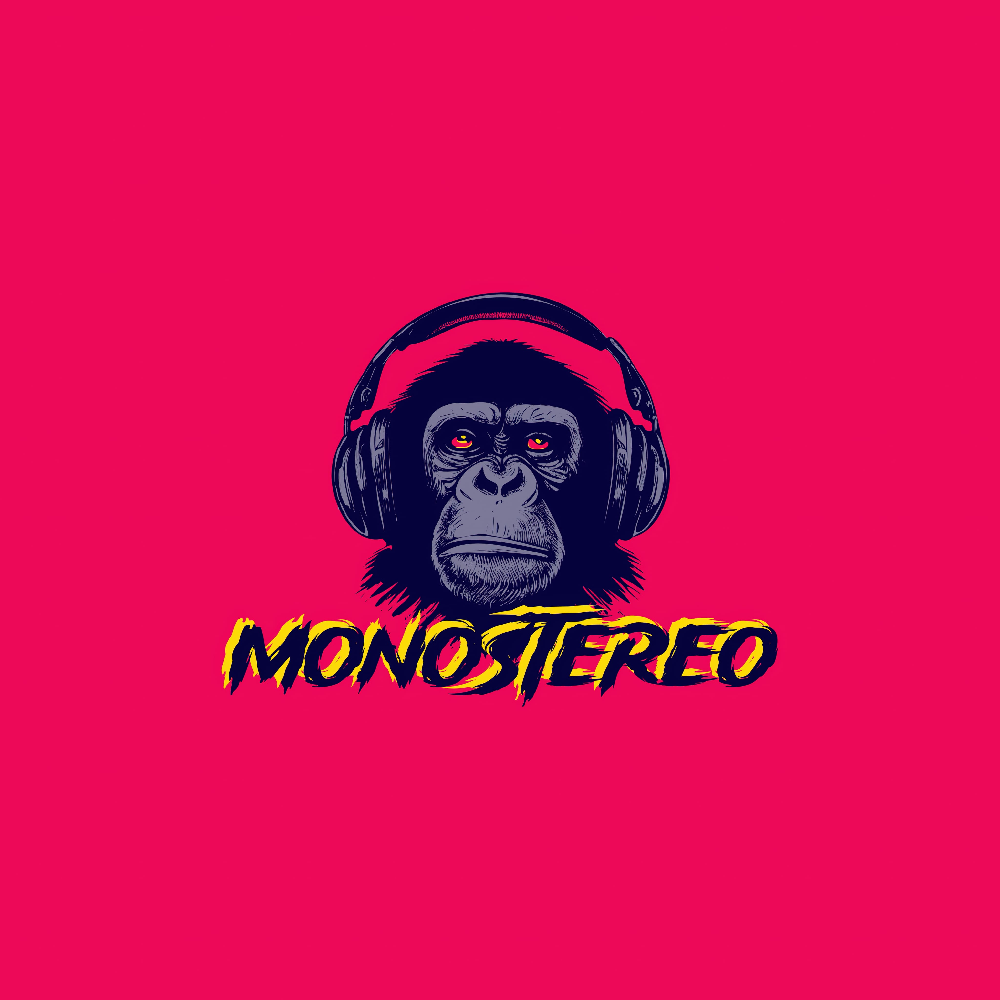

# MonoStereo 🙉
Client: MonoStereo
Year: 2019
Role: Mobile app, Illustration, Logo, Branding

A place where you can find podcasts on all kinds of topics, from science to philosophy to politics and everything in between!

We want to help you learn more about the world around you and make sure that you don’t miss out on anything interesting.
------------
## Exerpt
The podcast platform for primates
## Description
A place where you can find podcasts on all kinds of topics, from science to philosophy to politics and everything in between!

We want to help you learn more about the world around you and make sure that you don’t miss out on anything interesting.
## Media

------------
- **Slug:** monostereo
- **Date:** 18/11/2022
- **URL:** [https://phixel.net/en/portfolio/monostereo/](https://phixel.net/en/portfolio/monostereo/)
- **Type:** [Portfolio](#portfolio)
- **Hashtags:** #phixel, #monostereo, #mono, #stereo, #podcast, #podcastapp, #radio, #chimpanzee, #podcastaddict, #monkeybussines, #gorilla, #monkey, #primate, #chimp
- **Emojis:** 🐒 🎙 🦧 🔊 🎶

------------
## Tags
[ ](# )
