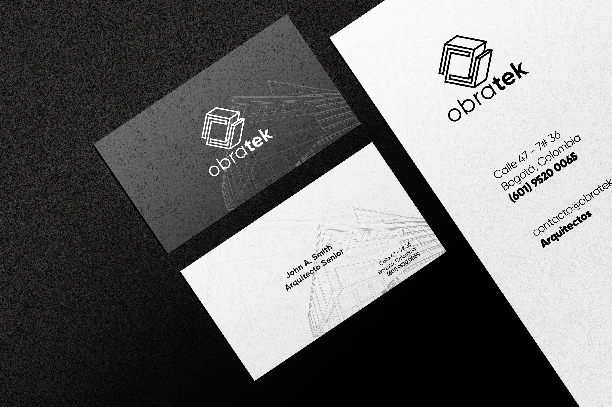
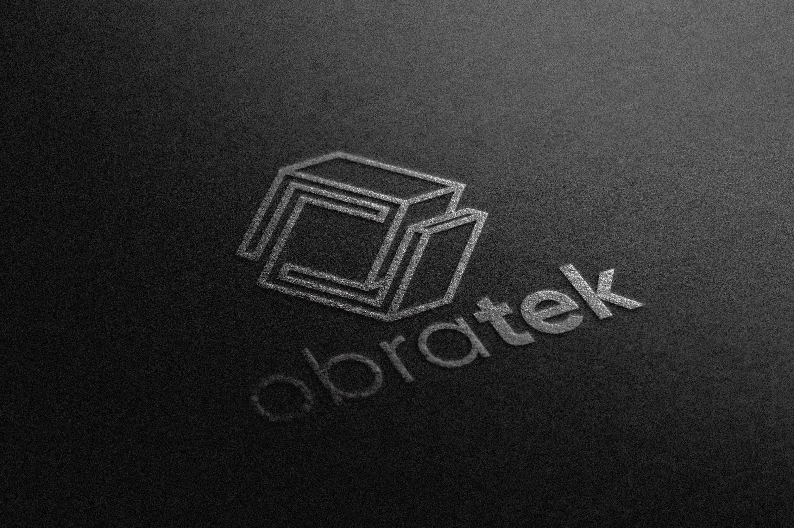
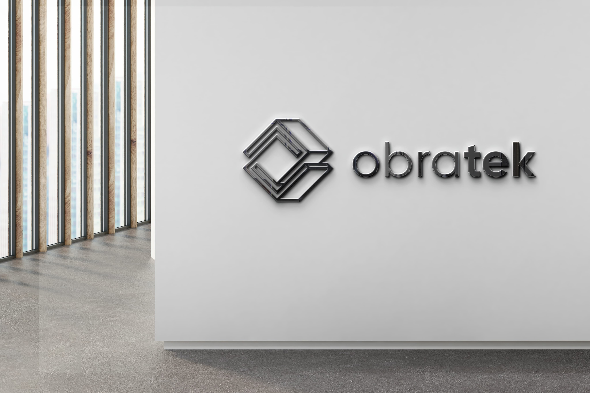
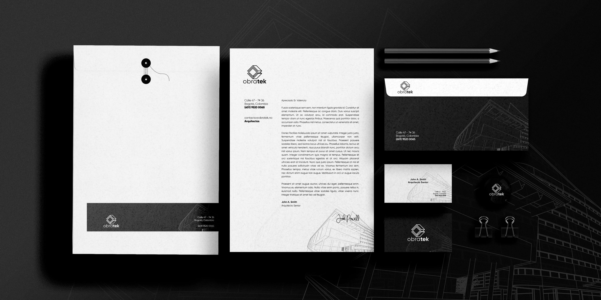
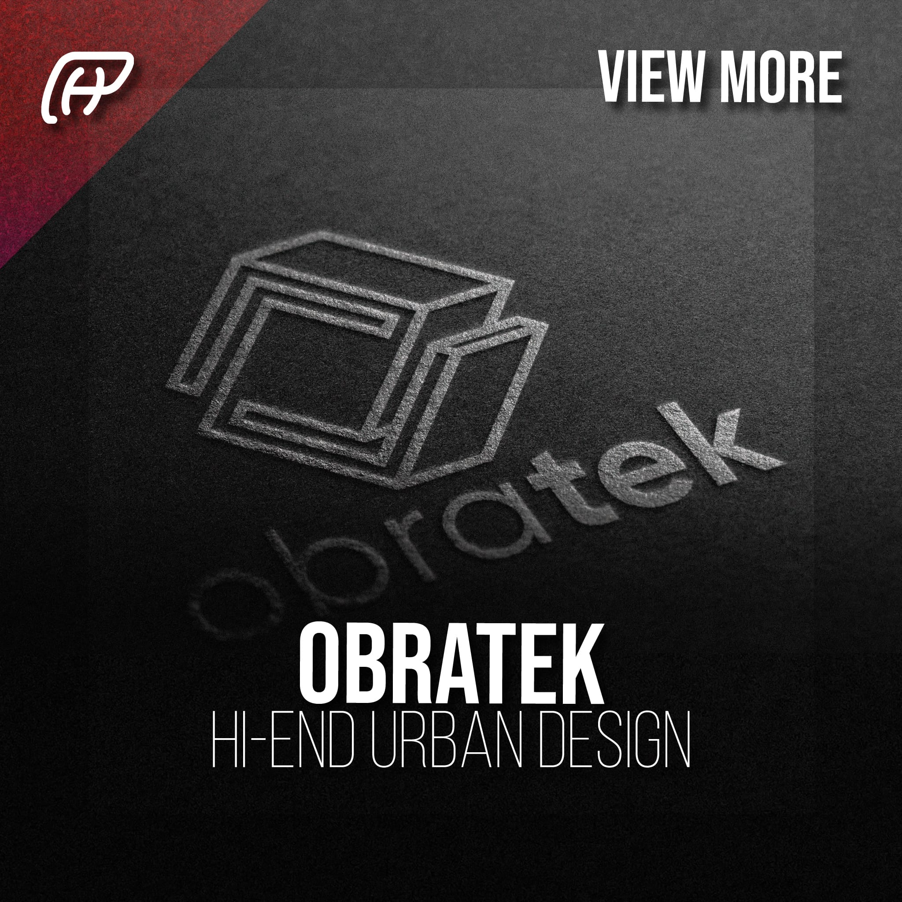

# Obratek 👷
Hi-end Urban Design Architecture
Client: Obratek
Year: 2018
Role: Rebranding, Logo, Motion Graphic, Stationery

Obratek is a hi-end urban design architecture firm based in Bogotá that provides cutting-edge design and consulting services for both public and private sector clients. Their team of architects, urban planners, and engineers have years of experience in delivering innovative, efficient, and sustainable solutions for some of the most complex challenges facing Latin American cities today.

Specializing in new construction and street restoration projects, Obratek has a proven track record of excellence and customer satisfaction.
------------
## Exerpt
Transform your city with Obratek's cutting-edge urban design services.
## Description
A hi-end urban design architecture firm based in Bogotá that provides cutting-edge design and consulting services for both public and private sector clients.
## Media
 
 
 
 
 
 
	<a href="media/eb2ec2db/obratek-video.mp4" target="_media">mp4: obratek-video.mp4</a> 
	<a href="media/df039047/obratek.glb" target="_media">glb: obratek.glb</a> 
 

------------
- **Slug:** obratek
- **Date:** 18/11/2022
- **URL:** [https://phixel.net/en/portfolio/obratek/](https://phixel.net/en/portfolio/obratek/)
- **Short URL:** [https://bit.ly/3JhUF3Q](https://bit.ly/3JhUF3Q)
- **Type:** [Portfolio](#portfolio)
- **Hashtags:** #obratek, #architecture, #design, #urban, #planning, #project, #colombia, #bogota, #city, #urbanplanning, #urbandesign, #hi-end
- **Emojis:** 👷🧱👷‍♂️🏗👷‍♀️🏛️🏠🏢🏰🗽⛲🛕🛠

------------
## Tags
[ ](# )
