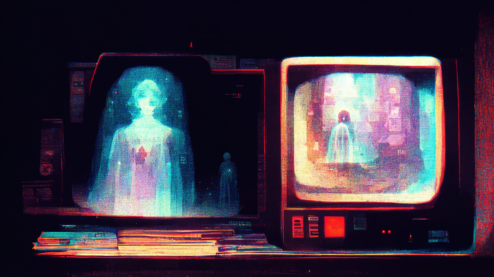

# Augmented & Virtual Reality 🥽
## Phixel is looking to provide our clients with innovative solutions that help them stay ahead of the curve and stay competitive in today’s marketplace.

Our team is comprised of experts in the field who are dedicated to providing the best possible user experience. We are committed to creating cutting-edge technology that will change the way people interact with the world around them.
------------
## Exerpt
We build groundbreaking Augmented & Virtual Reality experiences.
## Description
With Augmented Reality or Virtual Reality, businesses can create immersive, engaging experiences that help them modernize the way they work and discover new ways to engage customers.
## Media

------------
- **Slug:** service-ar-vr
- **Date:** 22/10/2022
- **URL:** [https://phixel.net/en/service/augmented-virtual-reality/](https://phixel.net/en/service/augmented-virtual-reality/)
- **Type:** [Service](#service)
- **Hashtags:** #phixel, #withlove, #webdesigners, #webdesignstudio, #phixelstudio, #design, #designer, #welcome, #webdevelopers, #videoeditors, #studio, #clients, #ui, #ux, #gui, #motiongraphics, #animation, #illustration, #3d, #foryou, #creativestudio
- **Emojis:** 🎨🛸📼📺📹👍🔗📝🏠✍️👨‍💻⚙️🔮🎬‍💻👑🗃️🕹️👾🎮📲🪐🌟👽🚀🌌

------------
## Tags
[ ](# )
